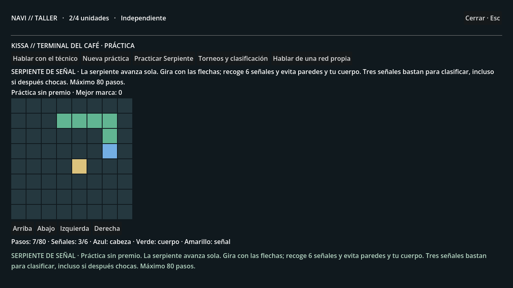
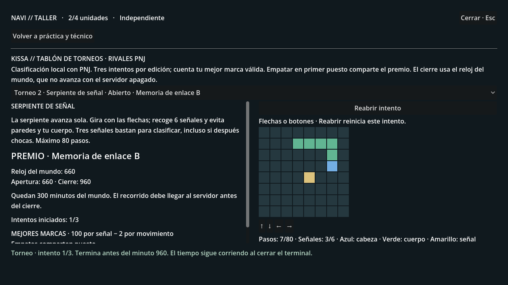

# WIRED 0.6 · Serpiente de señal

Rama **experiment/wired-0.6-arcade-catalog**, desde 631caca (torneos).
El café incorpora un segundo minijuego propio de estética retro, práctica con
marcas separadas y un catálogo editable de futuras ediciones. Los rivales siguen
siendo PNJ; esta fase no añade cuentas ni partidas entre personas.

## Probar el nuevo juego

1. Después de conectarte a la Wired, ve al terminal de **Kissa Café** y pulsa
   **Practicar Serpiente**. No hace falta esperar a un torneo.
2. La serpiente avanza sola, un paso cada cuarto de segundo, tras una breve
   pausa inicial. Gira con las flechas o los botones. No puede girar directamente
   hacia atrás. Azul es la cabeza, verde el cuerpo y amarillo la próxima señal.
3. Recoge seis señales y evita los bordes y tu cuerpo. Cada señal hace crecer
   la serpiente. Si una próxima señal ocuparía el cuerpo, el juego elige la
   siguiente posición libre de su secuencia.
4. El recorrido termina al recoger seis, chocar o agotar 80 pasos. Tres señales
   bastan para clasificar aunque después choques. La puntuación es **100 por señal
   menos 2 por paso**, con un mínimo de cero.
5. La práctica guarda una mejor marca independiente. **No entrega premios ni
   satisface la condición de Bit Courier del técnico**. Bit Courier conserva su
   práctica, marcas y recompensas.
6. En **Torneos y clasificación**, el selector muestra el juego de cada edición.
   Consulta sus reglas y premio antes de usar uno de sus tres intentos. Desde
   casa puedes consultar el mismo calendario en **PC → Eventos**.

El recorrido se verifica en el servidor. El cliente envía movimientos, no una
puntuación ni el juego con el que quiere validarlos. Cada intento conserva el
tablero que le corresponde. Los torneos de Serpiente usan el mismo cierre,
clasificación, desempate compartido y adjudicación única de la fase anterior.

Cerrar el terminal pausa la animación local, pero **el reloj del torneo sigue
corriendo**. Volver al mismo intento durante la sesión permite continuar el
recorrido local; **Reabrir intento** lo reinicia sin gastar otro. Reiniciar el juego
pierde los movimientos locales sin enviar. El servidor mantiene los intentos
consumidos, resultados y premios. Un resultado llegado después del cierre se
rechaza aunque hayas empezado a tiempo.

Se corrigió también la recuperación de respuestas perdidas: **Reintentar envío**
permanece disponible aunque se actualice el calendario. Conserva tanto el
identificador como el destino de la petición. Una respuesta vacía o mal formada
se presenta como un error recuperable sin provocar errores de análisis de Godot.

## Catálogo de próximas ediciones

El archivo del servidor es
[server/content/cafe_catalog.json](server/content/cafe_catalog.json).
Cada entrada indica identificador, juego, orientaciones y premio. Las entradas
se recorren en orden y las orientaciones cambian en cada vuelta del catálogo.
Esta rotación es determinista, no una selección aleatoria.

~~~json
{
  "revision": 2,
  "entries": [
    {
      "id": "serpiente_amortiguacion",
      "game": "signal_snake",
      "orientations": [0, 1, 2, 3],
      "prize": {"kind": "CODE", "model": "buffer"}
    }
  ]
}
~~~

Para modificarlo, edita el archivo, aumenta su revisión y comprueba su validez:

~~~powershell
python tools/check_arcade_catalog.py
~~~

Después reinicia el servidor. Puedes usar otro archivo mediante
**LAIN_ARCADE_CATALOG_PATH**; valídalo pasando esa misma ruta al comprobador.
La comprobación no abre ni modifica guardados.

Los juegos admitidos son **bit_courier** y **signal_snake**. Los premios admitidos
son código **routing**, **shield**, **scan**, **buffer**, y equipos **navi**,
**matrix**, **interface**, **cache**, con kind **CODE** o **DEVICE** respectivamente.
El archivo admite de 1 a 32 entradas y hasta 64 KiB. Rechaza identificadores
repetidos, juegos o equipos desconocidos, orientaciones inválidas y campos extra.
No admite código ejecutable ni define por sí solo mecánicas nuevas.

El catálogo cargado se conserva durante el proceso. Una edición ya anunciada
guarda su juego, tablero, premio, revisión y huella del catálogo: cambiar el
archivo **no modifica sus reglas, rivales, intentos ni premio**. Solo las
ediciones que aún no se hayan creado utilizarán el nuevo catálogo. Esto también
se aplica a las dos ediciones antiguas que pueda contener tu guardado: seguirán
siendo Bit Courier. Serpiente puede probarse inmediatamente en práctica.

Los premios mantienen propietario, edición y momento de adquisición. Las copias
equivalentes no duplican capacidad y se pueden aportar al círculo como antes.
K y Nora conservan sus memorias privadas. No hay emulación ni ROM de Spectrum,
autenticación multijugador o protección contra bots en esta entrega.

## Continuar tu partida

La carpeta local es **C:\Users\ENRIQUE\lain-arcade01**.
Se ha preparado **arcade01.db** a partir de **lain-events01\events01.db**,
conservando sus 68 tablas y añadiendo solo una tabla de tableros de práctica.
El guardado original se abre en modo lectura; no se sube a GitHub. Tu partida
continúa en el apartamento con el prólogo completado y el calendario anterior.

Cierra otro servidor si ocupa el puerto 8000. Servidor:

~~~powershell
cd C:\Users\ENRIQUE\lain-arcade01; powershell -ExecutionPolicy Bypass -File .\serve-city.ps1
~~~

Juego, en otra ventana:

~~~powershell
cd C:\Users\ENRIQUE\lain-arcade01; powershell -ExecutionPolicy Bypass -File .\play.ps1
~~~

El lanzador activa **LAIN_ARCADE_CATALOG=1** además de los torneos, círculos y
funciones anteriores; respeta tus ajustes de LLM. Si descargas esta rama en otro
equipo, copia tu partida con **tools/copy_workshop_save.py** a un destino nuevo.
Si todavía no existe el guardado elegido, se inicia una partida desde el prólogo.
Conserva la copia anterior para volver a una versión antigua del juego.

Desactivar el catálogo impide comenzar prácticas nuevas de Serpiente. Los
intentos ya guardados y torneos anunciados mantienen sus reglas y pueden
completarse; el catálogo antiguo rige las futuras ediciones aún no creadas.

## Comprobaciones

~~~powershell
python -m pytest -q
python tools/check_arcade_catalog.py
python tools/smoke_chapter01_http.py --events --arcade
Godot_v4.7.2-stable_win64_console.exe --headless --path client --script res://tools/test_arcade01.gd
~~~

Las pruebas verifican las cuatro orientaciones, crecimiento, colisiones, cola
que abandona su casilla, posiciones ocupadas, límites, recorridos incompletos,
marcas PNJ verificadas, prácticas sin premio, aislamiento de mejores marcas,
catálogos inválidos y conservación de ediciones al cambiar de catálogo.

Godot contrasta 182 estados de las reglas con resultados del servidor. Sus seis
vistas prueban controles, pausa al cerrar, resultado enviado una vez, separación
de práctica y torneo, cierre, premio y reintento tras pérdida de respuesta.
El recorrido HTTP usa un servidor, puerto, catálogo y mundo desechables. Las
capturas usan datos sintéticos y no contienen la partida del usuario.
