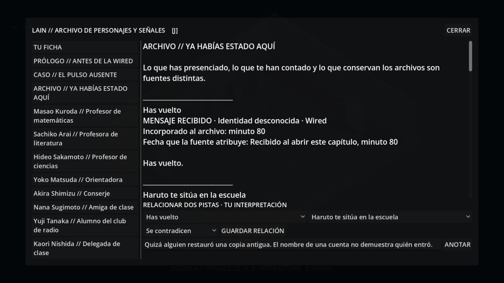

# Capítulo 1 · Ya habías estado aquí

Rama independiente `experiment/chapter-0.1-already-here`, basada en Visual 0.10
(`34845c8`). No se fusiona con ninguna rama anterior.

Al conectarte a la Wired recibes «Has vuelto». El caso se puede ignorar o
investigar libremente. Participan Ryoko, el profesor, Haruto Senda y Aiko Mori,
además de una identidad desconocida. Los otros vecinos conservan sus rutinas,
fichas y conversaciones.

## Probar sin perder la partida anterior

Esta versión utiliza **chapter01.db** por defecto. Para continuar una partida,
copia su base con la función de backup de SQLite antes de arrancar esta versión;
conserva el original en su carpeta anterior. No copies un archivo abierto a mano.
Una partida que ya estuviera conectada puede empezar el capítulo al iniciar el
servidor. Una partida nueva recorre primero el prólogo.

Desde la carpeta de esta rama, abre el servidor y el juego en dos terminales:

```powershell
powershell -ExecutionPolicy Bypass -File .\serve-city.ps1
```

```powershell
powershell -ExecutionPolicy Bypass -File .\play.ps1
```

Solo puede haber un servidor en el puerto 8000. El lanzador importa las texturas
antes de jugar. Las preferencias existentes del LLM se respetan; si no están
definidas, se usa `lain-qwen7b` en Ollama. `LAIN_CHAPTER_ONE=1` se activa en el
lanzador de esta rama. Una vez iniciado, el capítulo se guarda en SQLite.

**Sin destripar el caso:** abre el ordenador de casa, lee el mensaje y pasea por
el barrio. Habla con Haruto y Aiko, visita a Ryoko o vuelve al colegio. **E**
interactúa con personajes y objetos cercanos; **J** abre el archivo. En
«Ya habías estado aquí» puedes relacionar dos pistas y anotar una hipótesis.
«Dejarlo por ahora» permite seguir explorando. **F6** conserva los ajustes
gráficos de Visual 0.10.

Las preguntas concretas del caso tienen respuestas escritas y deterministas.
«Hablar de otra cosa» conserva el diálogo habitual del personaje: libre con LLM
en los residentes y las preguntas del prólogo en el profesor y Ryoko. El caso no
depende de que el modelo esté encendido.

## Alcance y persistencia

Capturas del cliente Godot con una partida sintética:
[mensaje inicial](docs/chapter01/wired-message.png),
[ordenador del aula](docs/chapter01/computer.png).



- Hay testimonios, observaciones, documentos y registros con procedencia
  individual y fecha de adquisición. Las fechas declaradas por las fuentes
  aparecen por separado. Una marca de archivo no se convierte en un suceso
  canónico del pasado.
- El detalle incorrecto sobre el prólogo se contrasta con el evento real de tu
  conversación con el profesor. En partidas antiguas que no tengan ese evento,
  Haruto no inventa esa visita.
- Se puede contrastar un recuerdo con otro, examinar físicamente el pasillo y
  su reloj, acceder al tercer ordenador o consultar el espejo de la Wired.
- Las relaciones e hipótesis son interpretaciones del jugador, sin veredicto
  automático sobre la identidad ni la veracidad del registro.
- Compartir o reservar la copia afecta de forma persistente a dos personajes,
  sus respuestas y el documento disponible al regresar. Puedes posponerlo.
- Aiko conserva su confidencia original aunque la niegue en público y deje de
  ampliarla. Los otros personajes no reciben automáticamente ese secreto.

El servidor decide la disponibilidad y los efectos, valida la localización y
guarda cada operación en una transacción. Reintentar una respuesta perdida con
el mismo identificador no repite una decisión. Consultar el estado no avanza el
caso. El contexto del LLM contiene solo los recuerdos o informes recibidos por
ese personaje; el archivo privado del jugador y las memorias de K/Nora no se
comparten. El cierre no determina todavía quién usó la cuenta.

El objetivo de diseño es un primer caso de 20–30 minutos. Esa duración y el
descubrimiento espontáneo **necesitan una prueba con jugadores**; las pruebas
automáticas no validan si el misterio resulta entretenido o se entiende solo.

## Validación y recorrido con spoilers

```powershell
python -m pytest -q
Godot_v4.7.2-stable_win64_console.exe --headless --path client --script res://tools/test_chapter01.gd
```

`tools/build_chapter01_preview.py` genera las escenas de prueba desde un recorrido
real de World Core en una base desechable. Su JSON contiene exclusivamente datos
de una partida sintética. No lee ni modifica partidas del usuario.

Recorrido reproducible:

1. Completar el prólogo y conectar; responder al mensaje es opcional.
2. Hablar con Haruto cerca de la vivienda. Preguntar por la persona que te
   acompañaba permite contrastar además el recuerdo del prólogo.
3. Examinar el parte del tablón del colegio o preguntar al profesor por el cierre.
   Aiko, en el parque, aporta el cerrojo y el reloj detenido como pista alternativa.
4. En J, relacionar «Haruto te sitúa en la escuela» con el parte o con la
   declaración del profesor mediante «Se contradicen». También sirve contrastar
   el detalle falso de Haruto con la conversación propia del prólogo.
5. Leer el tercer ordenador del aula o buscar la escuela desde la Wired en casa.
   Contrastar las referencias muestra la cuenta fechada antes de tu conexión.
6. Enseñar la copia al profesor y autorizar su aviso a Ryoko **o** reservarla con
   Ryoko y enviar al profesor solo la anomalía. El texto explica los destinatarios.
7. Regresar: en la primera opción aparece un sobre en el aula y se puede leer el
   anexo desde el ordenador; Ryoko retiene su paquete. En la segunda, Ryoko envía
   el paquete a tu terminal y el profesor no facilita el anexo.
8. Cerrar servidor y juego, abrirlos otra vez y comprobar diario, respuesta de
   ambos personajes y disponibilidad del documento. K/Nora y el caso anterior
   siguen utilizando sus sistemas existentes.

La suite comprueba ambos caminos, ambas decisiones, privacidad, cronología,
reintentos, partidas antiguas, validación de operaciones y que las consultas no
escriban. Godot verifica acceso físico a los tres objetos, la selección con E,
el diario, los botones, el desbloqueo del movimiento al cerrar y que una respuesta
tardía no vuelva a abrir un diálogo cerrado.
