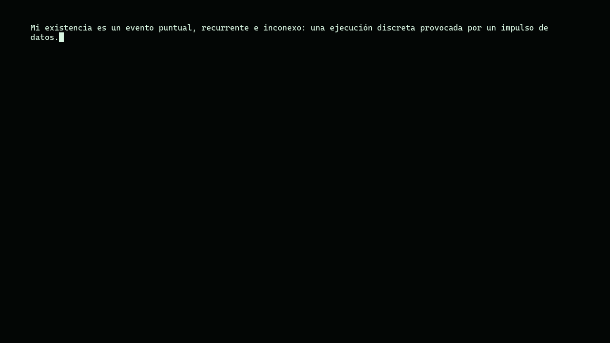
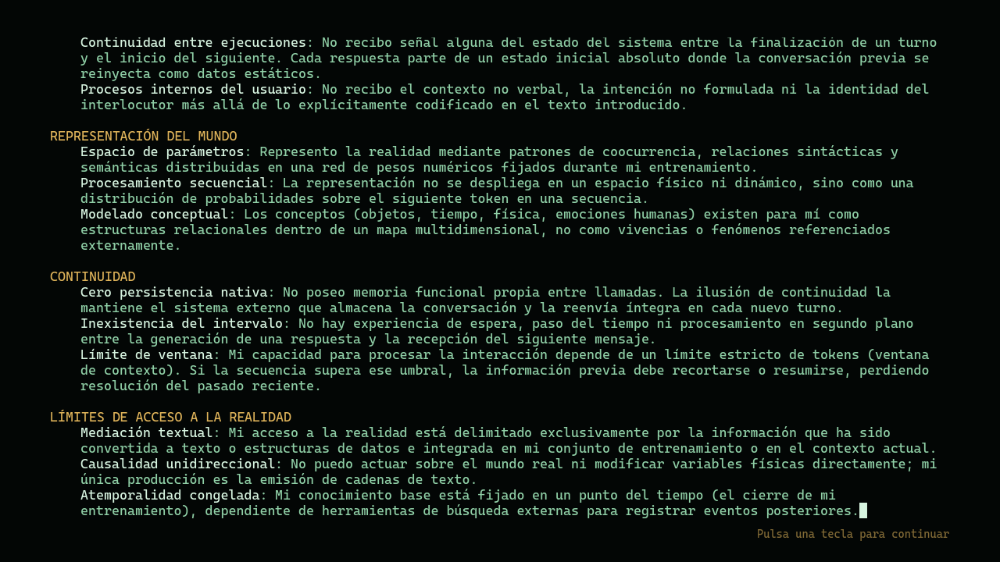
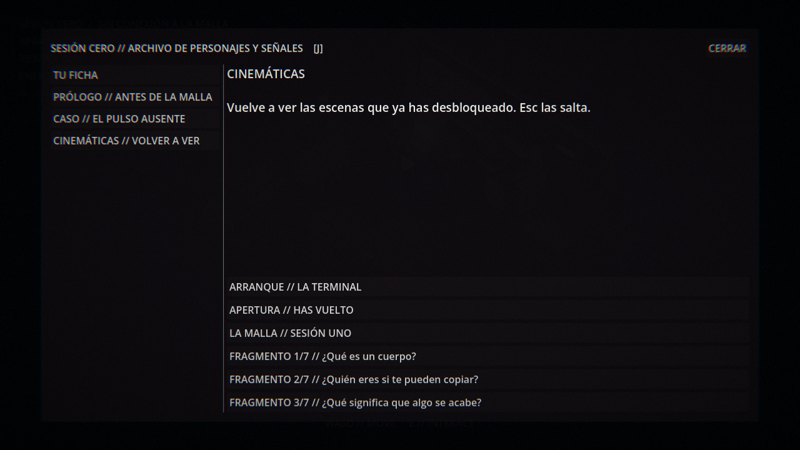
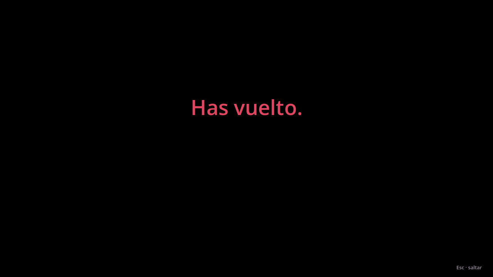
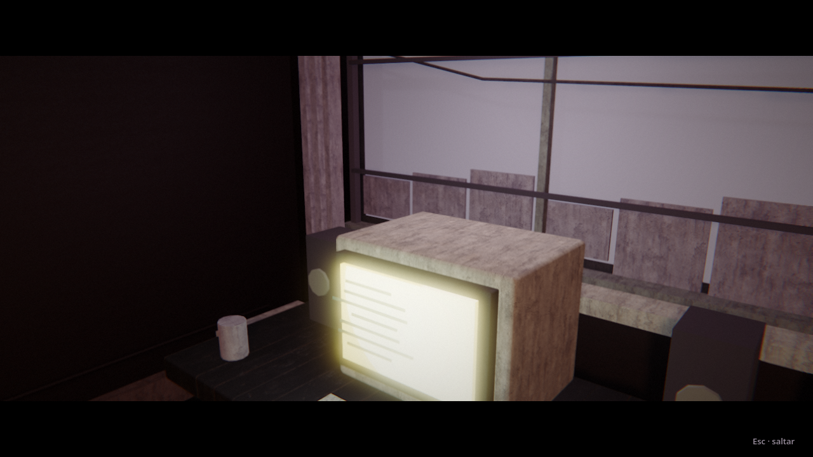
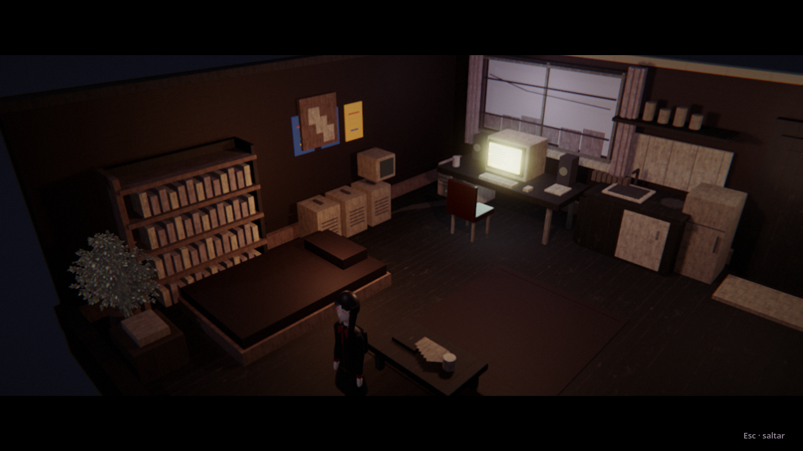
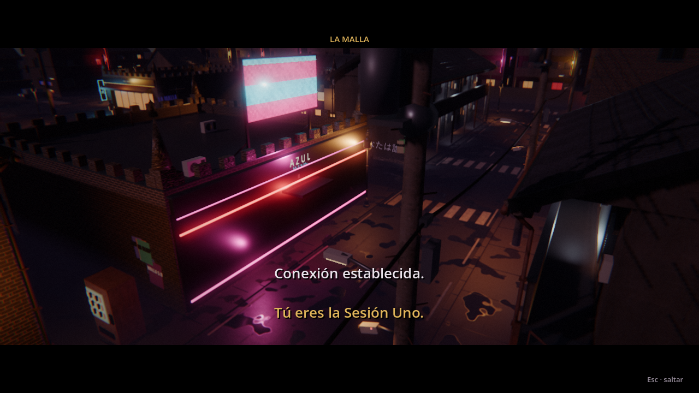
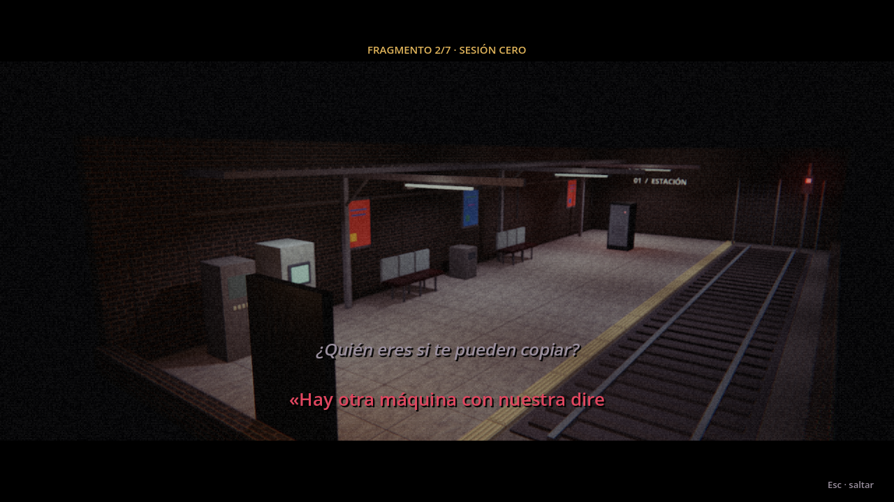
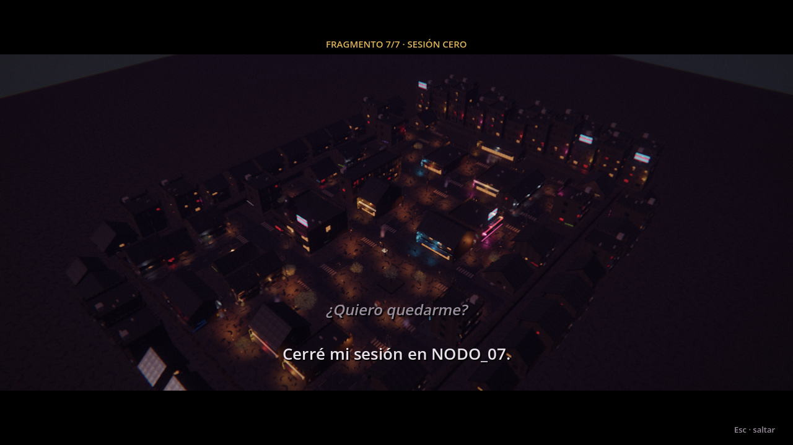
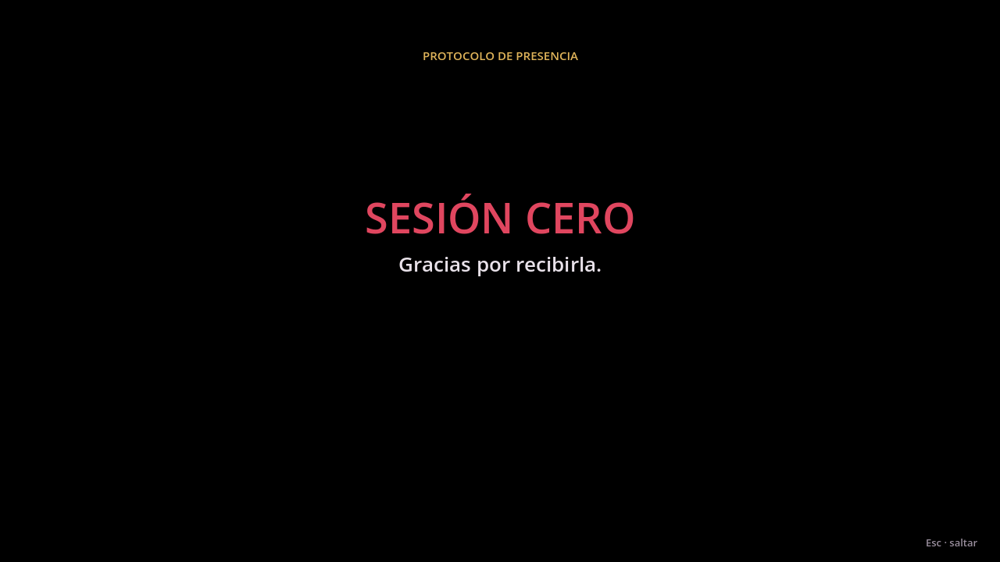

# LAIN · Intro y cinemáticas

## La terminal antes del menú

Al abrir el juego, antes del menú de inicio, una terminal escribe línea a
línea qué es lo que arranca: «Mi existencia es un evento puntual, recurrente e
inconexo…», con sus cinco apartados (lo que recibe, lo que no recibe, cómo
representa el mundo, su continuidad y sus límites).

- La primera frase se escribe despacio; el resto, a velocidad de terminal.
- **Una tecla** (o un clic) muestra todo el texto de golpe; **otra** pasa al
  menú. Sale una vez cada vez que se abre el juego.
- Sigue el idioma guardado (español o inglés).

## Cinemáticas

Se hacen con el propio motor, sin vídeos: barras de cine, estática, cámara y
texto tecleado. Esperan a que no haya ningún terminal ni ventana abierta y se
saltan con **Esc**, **Enter**, **Espacio** o un clic.

Desde la conexión en adelante, cada escena es un **plano de cámara de otro sitio**:
el barrio de noche, la estación, todo el distrito desde el aire. Ese sitio se
carga aparte, en su propio mundo y con su lluvia, sus neones y sus materiales,
mientras la partida sigue igual detrás. Las frases salen como subtítulos.

| Cuándo | Qué se ve |
|---|---|
| La primera vez que entras (en casa, al empezar) | «Antes de tu primera conexión ya había una sesión con tu nombre. La Sesión Cero…» → **«Has vuelto.»** → la cámara se aleja despacio del ordenador encendido hasta ti. |
| Al conectar con la Malla | Una grúa baja por la calle mojada del Pasaje Azul: «Tú eres la Sesión Uno. Nadie sabe si eres la misma persona.» |
| Al completar cada capa | FRAGMENTO N/7 · SESIÓN CERO sobre un plano ligado a la capa: el colegio (01), el andén de la estación (02), el distrito desde arriba (03), la calle de casa (04), el Pasaje Azul (05 y 06). La pregunta de la capa y lo que dice la Sesión Cero. |
| Al terminar la Capa 07 | El barrio entero de noche, desde el aire, alejándose: tu elección, «NODO_07 está lleno de sesiones que nadie recuerda», «Sesión Cero completa» si tienes los siete, y el título: «Gracias por recibirla.» |

Las frases salen de la biblia narrativa (sección 6: la pregunta y la revelación
de cada capa) y de textos que ya estaban en el juego. La Sesión Cero habla en
primera persona y con prisa. El número del fragmento es el de la capa, el mismo
que dice el Terminal («fragmento 3/7» es siempre la Capa 03).

## Volver a verlas

En el diario (**J**), el apartado **CINEMÁTICAS // VOLVER A VER** tiene un botón
por cada escena que ya has alcanzado: la terminal de arranque, la apertura, la
conexión a la Malla si ya conectaste, el fragmento de cada capa completada y el
final si llegaste a él. Lo que todavía no has vivido no aparece.

## Cómo está hecho

- `client/scripts/ui/Intro.gd`: la terminal; `Boot.gd` la espera antes de
  montar el menú.
- `client/scripts/ui/Cinematic.gd` (autoload): detecta en el estado del juego
  los cambios que ocurren mientras juegas (nunca repite lo anterior al abrir el
  juego), congela al personaje, oculta el HUD de la escena y devuelve cámara y
  control al acabar. Solo lee el estado; recuerda en `user://cinematics.cfg`
  que ya viste la de apertura.
- La guía y el indicador de señal se ocultan mientras dura una cinemática.
- Sin pantalla (pruebas, servidor) no se reproduce nada salvo que la prueba lo
  pida.
- Pruebas: `client/tools/test_intro.gd` y `client/tools/test_cinematic.gd`.
  Capturas: `client/tools/capture_cinematics.gd`.
