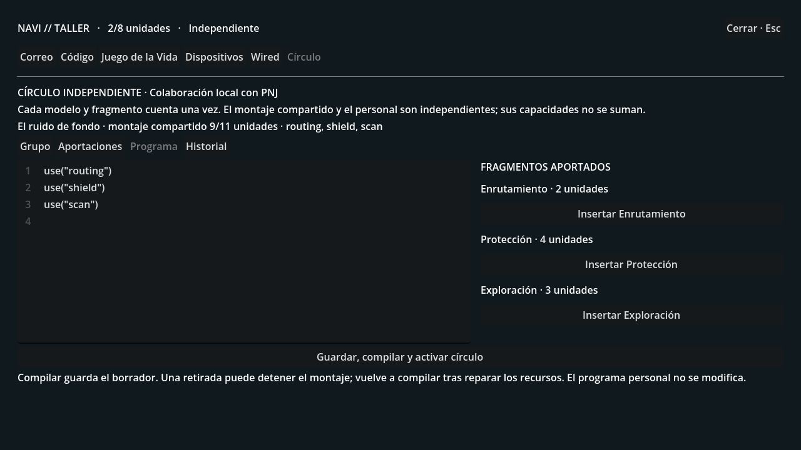
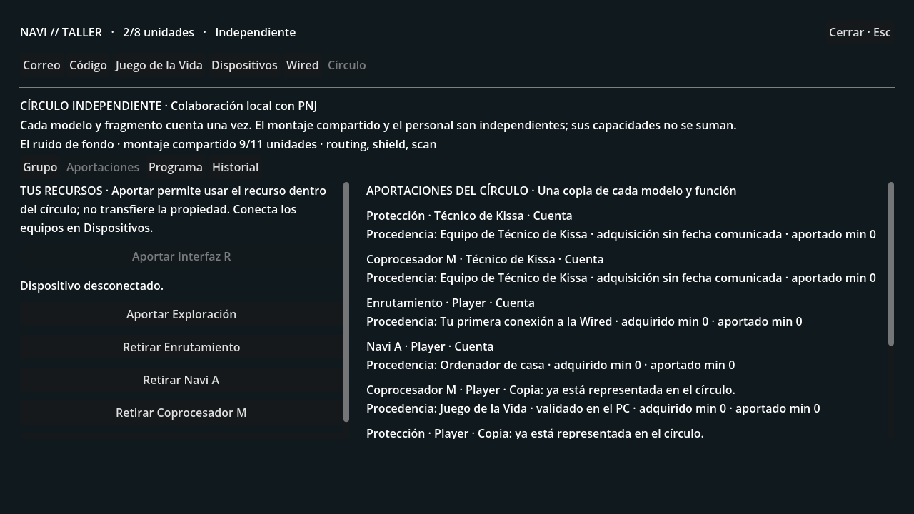

# WIRED 0.4 · Una red propia

Rama experimental **experiment/wired-0.4-circles**, desde ae731c1
(NOEMA). El PC incorpora **Círculo**, una red independiente con aportaciones
individuales y un programa compartido. Esta fase se juega con colaboradores PNJ.
No hay sesiones multijugador ni invitaciones a amigos reales todavía.

## Primer recorrido

1. Completa la primera conexión a la Wired y sigue como **Independiente**.
   Si tienes un contrato, puedes terminarlo desde **PC → Correo**.
2. Completa el **Juego de la Vida** en el PC, después de pedir las reglas al
   profesor. Recibirás Coprocesador M y Protección.
3. Habla con **Ryoko en AZUL** y elige **Hablar de crear una red propia**.
   Quiere demostrar que puedes mantener código propio. Si ya completaste el
   ejercicio, aceptará la invitación posterior.
4. En casa, abre **Círculo**, escribe un nombre y pulsa **Crear círculo**.
   En **Grupo**, invita a Ryoko. Ella aporta Navi A, Interfaz R y Exploración;
   esos recursos siguen siendo suyos.
5. Conecta tu Coprocesador M en **Dispositivos**. En **Círculo → Aportaciones**,
   aporta tu Navi A, Enrutamiento, Coprocesador M y Protección.
6. Abre **Programa**. Inserta los tres módulos o escribe:

~~~python
use("routing")
use("shield")
use("scan")
~~~

7. Pulsa **Guardar, compilar y activar círculo**. El programa consume **9 de
   11 unidades**. Los dos Navi A cuentan como un solo modelo funcional.
8. En un armario de enlace examinado, disputa control y usa **Ejecutar
   Protección** cuando termine el reajuste. Desde casa puedes ejecutar
   **Exploración**, en Wired, aunque tu programa personal solo tenga Enrutamiento.
9. Prueba a finalizar la colaboración con Ryoko. Si no has aportado otra copia
   propia de los recursos necesarios, el montaje compartido se detiene.
   Conservas tus equipos, tu programa personal y el borrador compartido.

## La otra entrada al círculo

En el terminal de **Kissa Café**, habla de una red propia con el técnico. Tras
ganar **Bit Courier**, aceptará colaborar aportando Coprocesador M y Protección.
Puedes formar una red con él, con Ryoko o con ambos. El técnico quiere conservar
las máquinas del café fuera del control de las corporaciones; Ryoko busca una
red donde las identidades no dependan de un administrador.

Con tu Navi y Enrutamiento más las aportaciones del técnico, puedes compilar
Enrutamiento y Protección por **6/8 unidades**, sin completar antes el ejercicio
del Juego de la Vida. Conocer a una persona no basta: el servidor comprueba su
condición al invitarla.

## Propiedad y capacidad

- El círculo cuenta una vez cada modelo de equipo y cada función de código,
  aunque haya varias copias de distinta procedencia.
- Cada aportación muestra propietario, procedencia, minuto de aportación y
  motivo si no cuenta. La adquisición de equipos PNJ figura sin fecha conocida;
  no se inventan fechas ni se revelan sus recuerdos.
- Solo puedes aportar recursos propios. Un equipo tiene que estar conectado.
  Los préstamos corporativos quedan excluidos.
- Los programas personal y compartido tienen presupuestos separados. Su
  capacidad no se suma. Una función disponible en ambos se ejecuta una sola vez;
  las defensas y pérdidas de control mantienen las reglas anteriores.
- La aportación da acceso compartido, no transfiere propiedad ni reparte cuotas
  territoriales. Cada cuenta conserva su control de los enlaces.
- Un PNJ solo puede pertenecer a un círculo a la vez. Invitaciones simultáneas
  no duplican sus recursos.
- Desconectar, retirar o perder un recurso necesario detiene el montaje dentro
  de la misma operación. Si queda una copia equivalente, el montaje sigue válido.
  Tras repararlo, hay que volver a compilar.
- Un contrato corporativo suspende tus aportaciones y el acceso al montaje
  compartido. El contrato, los recuerdos privados y el progreso no se cambian
  automáticamente.
- Disolver el círculo libera a sus colaboradores y elimina el acceso compartido;
  conserva los recursos y el programa personal. La interfaz pide confirmar esa
  acción antes de enviarla.

El editor conserva cambios al cambiar de pestaña y al cerrar y abrir el PC durante
la sesión. **Compilar guarda el borrador**, incluso si contiene un error. Cerrar
el juego descarta cambios que no hayas guardado mediante ese botón. Una
compilación fallida mantiene la última versión válida.

El lenguaje del montaje sigue siendo el cargador acotado de LAIN: solo admite
las llamadas use(...) conocidas. No ejecuta Python general ni comandos del sistema.

## Arranque y guardado

En este equipo está preparada **C:\Users\ENRIQUE\lain-circles01\circles01.db**,
copia consistente de noema01.db. Se verificaron todas las filas de sus 57 tablas
antes y después de añadir las seis tablas del círculo. Tu ubicación continúa
en el aula de informática; tus objetivos y colaboraciones nuevas están pendientes.
El guardado original se abrió solo para lectura y no se sube a GitHub.

Cierra el servidor anterior si ocupa el puerto 8000. Abre el nuevo servidor:

~~~powershell
cd C:\Users\ENRIQUE\lain-circles01; powershell -ExecutionPolicy Bypass -File .\serve-city.ps1
~~~

En otra ventana, abre el juego:

~~~powershell
cd C:\Users\ENRIQUE\lain-circles01; powershell -ExecutionPolicy Bypass -File .\play.ps1
~~~

El lanzador activa LAIN_CIRCLES=1, además del taller, NOEMA y el capítulo, y
mantiene tus ajustes de LLM. Para otro guardado, copia a un destino nuevo y
pásalo al lanzador:

~~~powershell
python tools/copy_workshop_save.py C:\ruta\noema01.db .\mi-copia.db
powershell -ExecutionPolicy Bypass -File .\serve-city.ps1 -WorldPath .\mi-copia.db
~~~

La desactivación de LAIN_CIRCLES oculta temporalmente el acceso compartido; no
borra las tablas del círculo ni sustituye programas personales.

## Comprobaciones

~~~powershell
python -m pytest -q tests/test_circles.py tests/test_workshop.py tests/test_noema.py tests/test_network_conflict.py
python tools/smoke_chapter01_http.py --circles
Godot_v4.7.2-stable_win64_console.exe --headless --path client --script res://tools/test_circles01.gd
~~~

Las pruebas deterministas cubren requisitos e identidad, aportaciones y copias,
propiedad, préstamos, privacidad, peticiones repetidas, invitaciones simultáneas,
compilación y revocación, conservación del guardado y efecto real de Protección
y Exploración. El recorrido HTTP usa movimientos y acciones reales en su propio
servidor, puerto y mundo temporales.

Godot comprueba once vistas: creación, acceso por Ryoko y el café, las cuatro
pestañas del círculo, edición e inserción de módulos, conservación de borradores,
defensa, escaneo, retirada y respuestas tardías. Las capturas proceden de datos
sintéticos. La batería anterior de ciudad, personajes, prólogo, capítulo, taller y
corporaciones continúa en los controles automáticos de la rama.

Las sesiones autenticadas para amigos reales, el reparto de acciones entre
miembros humanos, los torneos programados y sus clasificaciones online quedan
para fases posteriores. El servidor conserva el acceso local y no abre puertos
para otros equipos.
