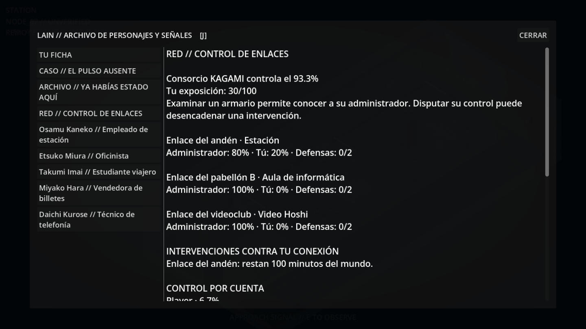

# WIRED 0.1 · El consorcio

Rama experimental `experiment/wired-0.1-corporation`, desde el capítulo 1
(`81ff1f4`), sin fusionar ninguna rama anterior.

La Wired existía antes de **Consorcio KAGAMI** (nombre provisional). La empresa
adquirió puntos de acceso, sustituyó claves y convirtió infraestructura común
en un sistema que administra para su propio beneficio. Tras sus contratas de
mantenimiento opera una organización que neutraliza a quienes intentan
controlar la red. Sus empleados encubiertos no llevan etiquetas de enemigo:
debes investigar para comprobar su afiliación.

## Primera versión jugable

Capturas del juego: [intervención en la estación](docs/corporation01/station-intervention.png),
[contrastar una credencial](docs/corporation01/operative-proof.png).



Tres enlaces físicos: **estación, aula de informática y Video Hoshi**. Cada uno
reparte exactamente 100 puntos entre el consorcio y las cuentas de jugadores.
Los porcentajes generales son el promedio de estos tres enlaces, no una medida
de toda la Wired ficticia. K y Nora mantienen sus facciones, memorias y acciones
anteriores: no se los convierte en agentes de KAGAMI.

1. Encuentra el armario de enlace y pulsa **E**. Examinarlo descubre los contratos
   y el tráfico de administración. El archivo **J → Red / Control de enlaces**
   conserva los informes con su procedencia y minuto de adquisición.
2. Disputa hasta **20 puntos** a KAGAMI. Aumenta tu exposición y provoca una
   intervención anunciada con **100 minutos del mundo** de margen. Con el reloj
   predeterminado de 8 segundos por avance de 10 minutos, son unos 80 segundos;
   viajar también avanza el tiempo. El diálogo del enlace no congela ese reloj.
3. Decide cómo responder. Cada defensa absorbe 15 puntos de la próxima represalia;
   puedes preparar dos. Ocultar el enlace cede hasta 5 puntos y cancela únicamente
   la intervención dirigida a tu cuenta en ese enlace.
4. También puedes examinar el tráfico mientras hay una intervención activa y
   contrastar la credencial con el personal presente. Una prueba vigente permite
   interrumpir todas las intervenciones de ese enlace y bloquear nuevas órdenes
   durante 120 minutos del mundo. Esto beneficia también a tus rivales.
5. Si no respondes, KAGAMI recupera hasta 30 puntos de tu cuota. Las defensas se
   consumen. La pérdida y su origen quedan en el diario. No hay castigos que se
   repitan indefinidamente por dejar el juego cerrado.

Las operaciones de control requieren un avance del reloj entre una y otra.
Investigar y hablar no gastan ese intervalo. La exposición refleja actividad
detectable en el enlace, no pensamientos o recuerdos privados del jugador.

En casa, el ordenador ofrece **Consultar el control de los enlaces** dentro del
menú de la Wired. Desde allí puedes consultar el archivo u ocultar enlaces
propios. Para conquistarlos, defenderlos o descubrir al agente debes ir al lugar.
La historia del capítulo 1, el prólogo, los 56 residentes y los gráficos siguen
disponibles. Los tres agentes nuevos usan diálogos escritos para este encuentro.

## Rivalidad y enemigo común

Las reglas admiten varias cuentas HUMAN verificadas por el servidor, comparten
el mismo presupuesto de control y mantienen una clasificación. Disputar una
cuota a un rival transfiere hasta 15 puntos y deja más exposición ante KAGAMI.
No se inventan jugadores para llenar la clasificación. Las pruebas verifican
dos cuentas, operaciones simultáneas y que cooperar contra un agente ayude a ambas.

**Esta entrega continúa siendo local.** No hay todavía inicio de sesión online,
servidor público ni otros usuarios conectándose al cliente. La API conserva
`PLAYER_1` como identidad decidida por el servidor y rechaza un `actor_id` enviado
por el cliente. Antes de habilitar online se necesitan sesiones autenticadas,
autorización y visibilidad por jugador, presencia, concurrencia entre procesos,
límites contra abuso y adaptar las pausas de conversación del mundo compartido.
No debe exponerse la API actual a Internet como si ya fuera un servicio multijugador.

## Ejecutar y guardar

El lanzador usa `corporation01.db` y activa `LAIN_CORPORATION=1`. Para continuar
una partida, utiliza una copia SQLite consistente de su base y conserva el
original. El consorcio se habilita después de la primera conexión a la Wired;
no permite saltarse el prólogo. Se guardan cuotas, defensas, intervenciones,
descubrimientos individuales, informes y protección temporal al reiniciar.

Servidor, desde esta carpeta:

```powershell
powershell -ExecutionPolicy Bypass -File .\serve-city.ps1
```

Juego, en otra ventana:

```powershell
powershell -ExecutionPolicy Bypass -File .\play.ps1
```

## Pruebas

```powershell
python -m pytest -q tests/test_network_conflict.py
python tools/smoke_chapter01_http.py --network
Godot_v4.7.2-stable_win64_console.exe --headless --path client --script res://tools/test_conflict01.gd
```

World Core decide los resultados y valida la localización. Cada operación tiene
transacción y un identificador de reintento; las consultas de estado no avanzan
represalias ni crean control. Las pruebas cubren conservación de los 100 puntos,
reintentos, concurrencia, defensa, retirada, documentos caducados, secretos por
cuenta, recuperación de partida y compatibilidad con el prólogo.

`tools/build_conflict01_preview.py` genera las capturas de prueba desde acciones
reales de este módulo en una base desechable. Sus posiciones iniciales se preparan
para la captura; nunca lee partidas del usuario. La comprobación Godot usa escenas
reales y valida acceso, selección con E, diario, tamaño de botones y cierre de
diálogos. El balance y la tensión del enfrentamiento necesitan pruebas jugando;
los valores de esta versión son ajustables.
