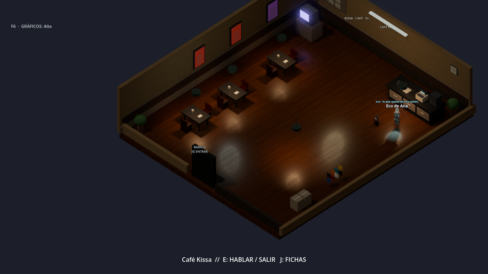

# Sesión Cero · El eco camina por el mundo

Quien elige **«Desconectarte»** al final de la Capa 07 cierra su sesión para que
la Sesión Cero descanse. Antes, lo que quedaba de esa persona solo se podía leer
dentro de NODO_07 (`GET /ecos/<nombre>`). Ahora su **eco camina por el barrio**,
y los demás jugadores se lo encuentran.

## Cómo es

- **Recorre sus sitios de siempre.** El eco va por los tres lugares públicos que
  más visitaba su jugador (nunca su casa) y se queda unos 20 minutos en cada uno.
- **Se ve distinto.** Tiene la silueta de un ciudadano, translúcida y con un
  brillo frío; de vez en cuando parpadea, como una señal que se pierde. Lleva el
  nombre «Eco de …» y la etiqueta «eco · lo que queda de una sesión».
- **Se le puede hablar** como a cualquier personaje (E). Saluda con «Soy lo que
  queda de …. Pregúntame qué viví.» y contesta con lo que esa persona vivió en la
  partida, en primera persona: si empalmó el cable, si reenvió el paquete, si se
  quedó la cuenta… y cómo terminó.
  - Con la IA encendida, el personaje habla con esos recuerdos con sus propias
    palabras.
  - Sin IA, responde cada vez con un recuerdo distinto.
- **No hace nada por su cuenta**, como los vecinos: la simulación no le da
  objetivos. Solo camina su ruta y escucha.

## Cómo está hecho

- `server/world_core/echoes.py`: la ruta (eventos `MOVE` del jugador), el
  agente `ECHO_<jugador>` con controlador `ECHO`, sus recuerdos para la IA y la
  respuesta sin IA. La simulación lo añade al arrancar y en cada paso del reloj
  lo mueve y añade los ecos nuevos.
- El eco aparece en los actores visibles con `"kind": "echo"`, tiene ficha
  («Eco») y entra en la conversación normal.
- `client/scripts/world/ActorSpawner.gd` lo dibuja translúcido y lo hace parpadear.
- Pruebas: `tests/test_echoes.py` (la ruta, que solo «Desconectarte» deja eco, la
  conversación, la ficha y el inglés) y `client/tools/test_echo.gd`.
