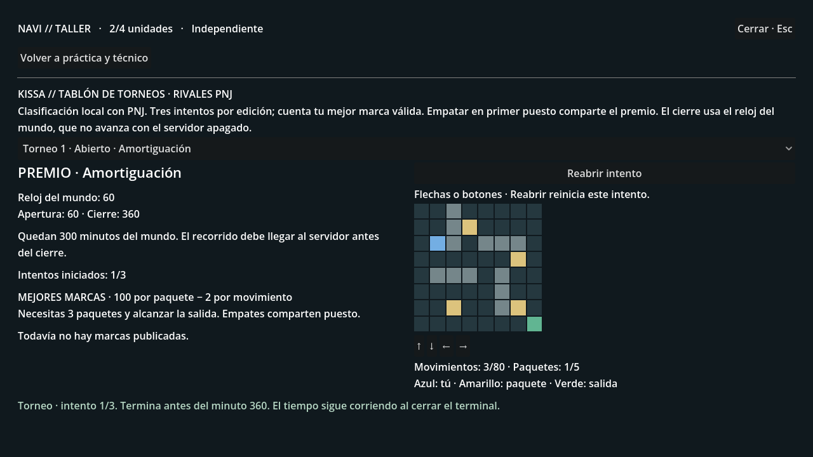
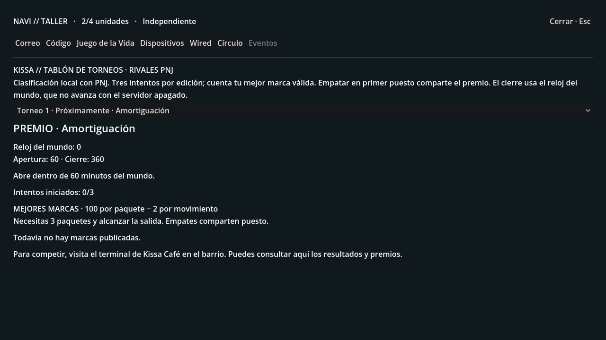
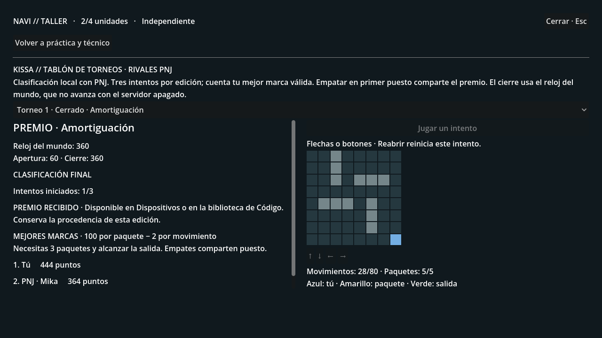

# WIRED 0.5 · Las noches de Kissa

Rama **experiment/wired-0.5-cafe-events**, desde ff2b84c (círculos).
El terminal del café organiza torneos de Bit Courier con calendario, tres
intentos por edición, clasificación persistente y premios utilizables en el PC.
Los dos contrincantes, Aki y Mika, aparecen identificados como **PNJ**.
No hay otros usuarios conectados ni sesiones multijugador en esta entrega.

La siguiente fase está en [WIRED 0.6 · Serpiente de señal](ARCADE01_README.md),
con un segundo juego y un catálogo ampliable de futuras ediciones.

## Probarlo

1. Tras la primera conexión a la Wired, abre **PC → Eventos**. También hay un
   acceso en Correo. Comprueba el premio, la apertura y el cierre.
2. Visita **Kissa Café**, usa su terminal con **E** y elige **Torneos y
   clasificación**. La práctica anterior y el técnico siguen disponibles.
3. Cuando abra una edición, pulsa **Jugar un intento**. Usa las flechas o los
   botones. Recoge al menos tres paquetes y alcanza la salida antes del cierre.
   Hay cinco paquetes y un máximo de 80 movimientos; los choques también cuentan.
4. La marca es **100 puntos por paquete menos 2 por movimiento**. Se conserva
   tu mejor recorrido válido entre tres intentos. Puedes consultar los resultados
   desde casa. El servidor verifica los movimientos; no acepta una puntuación
   elegida por el cliente.
5. Al cerrar, el primer puesto recibe automáticamente el premio en su biblioteca
   o inventario. Los empates en primera posición comparten premio. El resto no
   recibe ese premio. Queda un informe individual en la actividad de la Wired.
6. El primer torneo entrega **Amortiguación**. En **PC → Código**, inserta ese
   módulo junto a Enrutamiento y compila. Consumen 4 unidades, disponibles con
   tu Navi inicial. Amortiguación absorbe hasta 5 puntos de pérdida en cada
   intervención de KAGAMI o NOEMA mientras siga compilada.

## Calendario y reglas

El calendario empieza una sola vez al activar esta fase para una partida ya
conectada, o después de la primera conexión de una partida nueva. La primera
apertura llega 60 minutos del mundo después. Cada edición dura 300 minutos y
las aperturas están separadas por 600 minutos. No son minutos de reloj real.

Con el ritmo predeterminado de 10 minutos del mundo por ciclo de 8 segundos, la
primera espera dura unos 48 segundos y una ronda unos 4 minutos. Las acciones
del mundo también avanzan la simulación. El tiempo sigue pasando con el terminal
abierto; no se recupera tiempo real transcurrido con el servidor apagado.

El intervalo admite intentos desde la apertura inclusive hasta antes del cierre.
Empezar antes no permite enviar un resultado tarde. Cerrar y volver a abrir el
terminal conserva el intento disponible: **Reabrir intento** reinicia su recorrido
sin consumir otro. Un reinicio del juego tampoco concede intentos extra.
Los reintentos de red conservan su identificador y no duplican premios.

Cada edición guarda su tablero, premio y fechas. Hay cuatro orientaciones del
tablero y un catálogo rotatorio: Amortiguación, Memoria de enlace B, Protección y
Exploración. La memoria es un equipo de 2 unidades que debes conectar. Cada
premio tiene propietario, edición de procedencia y minuto de adjudicación.
Recibir varias copias conserva esas procedencias, pero un modelo o función
cuenta una sola vez. Los premios propios se pueden aportar al círculo.

Amortiguación funciona también desde un programa compartido válido. Tenerla
en el programa personal y en el compartido absorbe 5 puntos, no 10. Las defensas
y contratos mantienen sus reglas. El módulo no conquista territorio ni impide
que las dos corporaciones programen operaciones independientes.

Los PNJ publican sus marcas en momentos definidos de la ronda; sus resultados
se calculan con recorridos válidos y las mismas reglas. No se muestran marcas
futuras. El tablón publica nombres y resultados, no recorridos privados ni
recuerdos de K, Nora u otros personajes.

Esta fase usa un catálogo definido y competición local. Quedan pendientes las
cuentas autenticadas, las competiciones entre personas, medidas contra bots y
un catálogo administrable de nuevos juegos y premios. No abre el servidor a
Internet. Es un minijuego propio con estética retro, no un emulador de Spectrum.

## Continuar la partida en este equipo

La carpeta es **C:\Users\ENRIQUE\lain-events01**.
**events01.db** conserva una copia de la partida que empezaste desde cero,
**lain-circles01\circles01-new-player.db**, ya conectada y en el apartamento.
El origen se abrió solo para lectura. Se verificaron todas sus tablas antes y
después de añadir las cinco tablas de los torneos. Los guardados son locales y
no se suben a GitHub. Las carpetas y partidas anteriores siguen disponibles.

Si hay otro servidor en el puerto 8000, ciérralo primero. Servidor:

~~~powershell
cd C:\Users\ENRIQUE\lain-events01; powershell -ExecutionPolicy Bypass -File .\serve-city.ps1
~~~

Juego, en otra ventana:

~~~powershell
cd C:\Users\ENRIQUE\lain-events01; powershell -ExecutionPolicy Bypass -File .\play.ps1
~~~

El lanzador activa **LAIN_CAFE_EVENTS=1** y las funciones anteriores. Conserva tus
ajustes de LLM. Si descargas la rama en otro equipo, elige entre copiar un guardado
o empezar una partida nueva con un nombre que todavía no exista:

~~~powershell
python tools/copy_workshop_save.py C:\ruta\partida.db .\events01.db
powershell -ExecutionPolicy Bypass -File .\serve-city.ps1
~~~

Para empezar desde cero, omite la copia y usa
**serve-city.ps1 -WorldPath .\events01-nueva.db**. El prólogo sigue siendo obligatorio.
Desactivar LAIN_CAFE_EVENTS oculta el calendario y suspende los torneos; no elimina
premios propios ni programas compilados. No abras este nuevo guardado con una
versión anterior que desconozca sus nuevos equipos y módulos.

## Validación

~~~powershell
python -m pytest -q
python tools/smoke_chapter01_http.py --events
Godot_v4.7.2-stable_win64_console.exe --headless --path client --script res://tools/test_events01.gd
~~~

Pruebas deterministas del prólogo, calendario, límites exactos, ubicación e
identidad, tres intentos, mejores marcas, recorridos inválidos, empates,
peticiones simultáneas, cierre único, propiedad, procedencia, compilación,
efecto real contra ambas corporaciones y programas compartidos. La migración
es aditiva y los sondeos no modifican el calendario ni conceden recompensas.

El recorrido HTTP usa un mundo y un puerto temporales: viaja al café, juega,
avanza el reloj con acciones normales, recibe el premio y compila desde casa.
Las siete vistas de Godot comprueban calendario, acceso físico, tablero,
orientación reflejada, conservación del recorrido entre sondeos, clasificación,
cierre y premio. Las capturas usan datos sintéticos.
