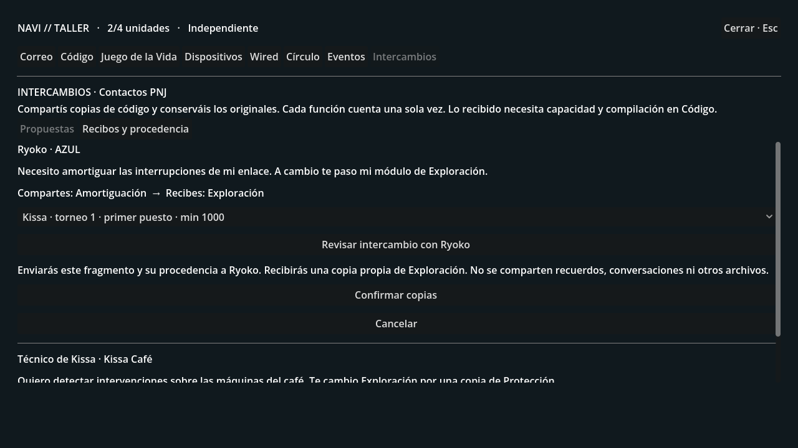
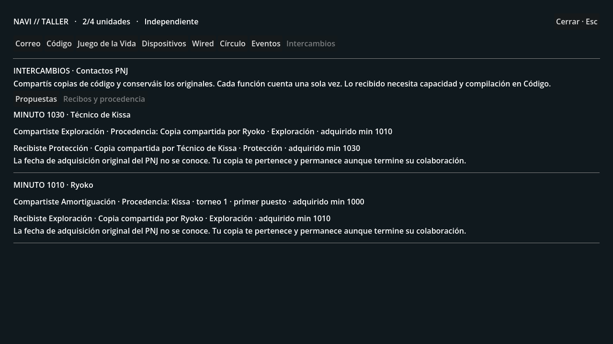

# WIRED 0.7 · Copias entre contactos

Rama **experiment/wired-0.7-code-exchange**, desde 2585e5f (arcade).
Ryoko y el técnico de Kissa pueden intercambiar copias de fragmentos contigo.
Un premio del café puede convertirse en otro módulo por una vía social.
Las propuestas son de PNJ locales; esta fase todavía no conecta jugadores reales.

## Recorrido para probarlo

1. Completa la primera conexión a la Wired. En **PC → Intercambios** aparecen
   los dos contactos y dónde encontrarlos. Sus propuestas se descubren hablando.
2. Visita a **Ryoko en AZUL** y elige **Hablar de intercambiar código**. Está
   disponible tanto en la conversación del capítulo como en la del prólogo.
   Propone recibir **Amortiguación** y compartir **Exploración**.
3. En el terminal de **Kissa Café**, pulsa **Intercambiar código**. El técnico
   pide **Exploración** a cambio de **Protección**. Estas propuestas no exigen
   crear un círculo ni cumplir las condiciones para invitar a esos PNJ al círculo.
4. Consigue Amortiguación en una edición que la ofrezca en **Eventos**. También
   puedes usar una copia propia que ya tengas. Para la propuesta del técnico,
   sirve la Exploración propia obtenida en Bit Courier o mediante Ryoko.
5. Vuelve al apartamento. En **PC → Intercambios**, elige la copia por su origen
   y fecha, pulsa **Revisar intercambio** y luego **Confirmar copias**. Debes seguir
   independiente; puedes terminar un contrato corporativo desde Correo.
6. Consulta **Recibos y procedencia**. Conservas el original y recibes una copia
   propia. El PNJ obtiene únicamente el fragmento elegido y su procedencia.
7. En **Código**, inserta lo recibido y compila. Exploración con Enrutamiento
   requiere **5 unidades**; Protección con Enrutamiento requiere **6**. Tu Navi
   inicial aporta 4: conecta, por ejemplo, la Interfaz R ganada en Bit Courier,
   el Coprocesador M del Juego de la Vida o una Memoria de enlace B de un torneo.
8. También puedes aportar la nueva copia a un círculo. Solo se cuenta una vez
   cada función, aunque tenga varios propietarios u orígenes.

## Propiedad y consecuencias

Cada propuesta puede completarse una vez por cuenta. Repetir una petición,
recibir tarde la respuesta o pulsar desde dos conexiones no entrega copias extra.
El intercambio guarda ambos lados en una sola operación: contacto, fragmento
compartido, copia recibida, fuente y minuto. Los recibos anteriores no cambian
si posteriormente cambia la descripción del recurso original.

Las copias son permanentes. Terminar una colaboración o firmar después un
contrato no las retira. Los préstamos corporativos y el código aportado por otro
miembro de un círculo no son tuyos y no sirven para completar una propuesta.
El intercambio tampoco cambia automáticamente tu programa, capacidad o control
territorial. Debes compilar y usar los módulos con las reglas existentes.

Las propuestas expresan el consentimiento de cada PNJ para esas dos operaciones
concretas. Sus recibos registran la entrega; esta fase no simula que el PNJ compile
lo recibido ni cambia automáticamente su programa compartido. No es un mercado
de dispositivos, ni una clasificación entre personas.

El origen de la copia recibida identifica al PNJ. No inventamos cuándo obtuvo
su original: esa fecha figura como desconocida. Si vuelves a compartir una copia,
el nuevo recibo conserva su fuente y fecha de adquisición, y el recibo anterior
sigue disponible. Los recuerdos privados de K, Nora y los otros personajes no
entran en estas propuestas o recibos.

La página distingue contactos desconocidos, fragmento ausente, contrato
incompatible e intercambio completado. Antes del envío muestra exactamente qué
se comparte. **Cancelar** no realiza ninguna operación; **Reintentar envío**
conserva el identificador y el destino de la petición original.

## Continuar tu partida

Carpeta local: **C:\Users\ENRIQUE\lain-exchange01**.
Se preparó **exchange01.db** desde **lain-arcade01\arcade01.db**, conservando
exactamente las filas de sus **69 tablas** y añadiendo tres tablas de intercambios.
La partida sigue en el apartamento, minuto 8410, con el prólogo completado.
El original se abrió solo para lectura. Los guardados no se suben a GitHub.

Si tienes otro servidor ocupando el puerto 8000, ciérralo antes. Servidor:

~~~powershell
cd C:\Users\ENRIQUE\lain-exchange01; powershell -ExecutionPolicy Bypass -File .\serve-city.ps1
~~~

Juego, en otra ventana:

~~~powershell
cd C:\Users\ENRIQUE\lain-exchange01; powershell -ExecutionPolicy Bypass -File .\play.ps1
~~~

El lanzador activa **LAIN_CODE_EXCHANGE=1**, junto con las funciones anteriores,
y respeta tus ajustes del LLM. En otro equipo puedes copiar un guardado a un
destino nuevo con **tools/copy_workshop_save.py** y pasarlo con **-WorldPath**.
Si el destino aún no existe, el servidor inicia una partida nueva desde el prólogo.
Desactivar esta función oculta propuestas y bloquea operaciones nuevas, pero
conserva los recibos y el código propio adquirido.

## Comprobaciones

~~~powershell
python -m pytest -q
python tools/smoke_chapter01_http.py --events --exchange
Godot_v4.7.2-stable_win64_console.exe --headless --path client --script res://tools/test_exchange01.gd
~~~

Las pruebas verifican presencia física, primera conexión, independencia,
propiedad, préstamos, copias repetidas, peticiones simultáneas, recuperación de
respuestas, procedencia inmutable, capacidad, compilación, aportaciones al círculo,
aislamiento por cuenta y conservación de las otras tablas del mundo.

La prueba HTTP recorre un mundo temporal: gana Amortiguación en un torneo,
habla presencialmente con los dos contactos y realiza los dos intercambios desde
casa. Comprueba identidad, ubicación, recibos y consultas sin efectos secundarios.
Godot prueba ocho vistas, ambas rutas de conversación con Ryoko, acceso en el
café, revisión, cancelación, estado bloqueado, historial y reintentos.
Las capturas se generan con datos sintéticos, fuera de tu partida.
