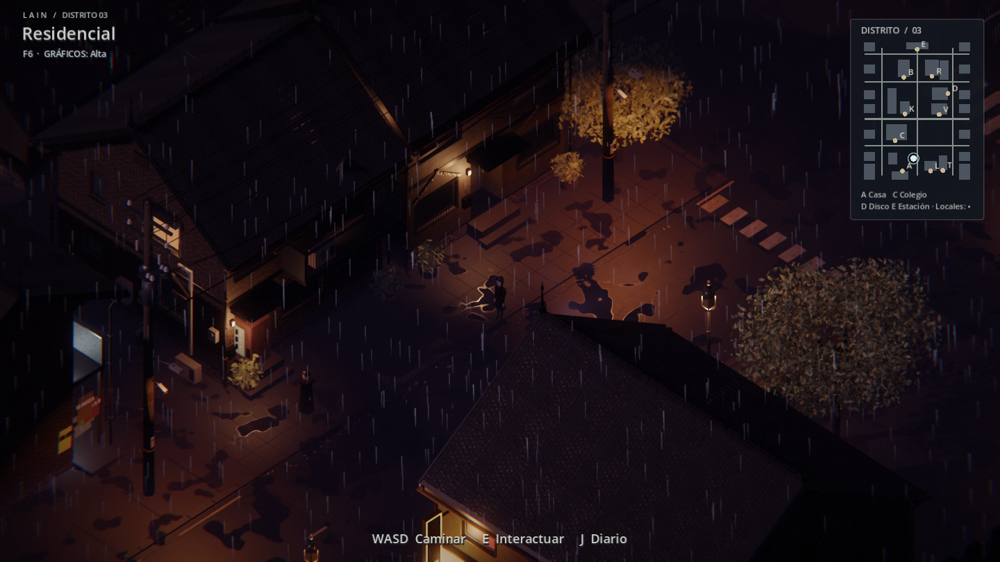

# LAIN · Visual 0.12 — Tokio gótico nocturno

Rama: `experiment/visual-0.12-gothic`, sobre `experiment/visual-0.11-photoreal`.
Solo cambian los gráficos y la ambientación: la historia, la jugabilidad, el
servidor, el guardado y las colisiones son los mismos.

| Antes (0.11) | Ahora (0.12) |
| --- | --- |
|  |  |

Más capturas: [tiendas](docs/gothic12/images/shops.png),
[club AZUL](docs/gothic12/images/club.png),
[estación](docs/gothic12/images/station.png),
[plaza](docs/gothic12/images/park.png),
[a pie de calle](docs/gothic12/images/closeup.png),
[interior del club](docs/gothic12/images/nightclub-interior.png) y
[apartamento](docs/gothic12/images/apartment-interior.png). Todas son de
Godot 4.7.2, sin retoque.

## Dirección de arte

Un barrio japonés de finales de los 90 en una noche que no termina: el mismo
trazado, corrompido por arquitectura gótica y neón, con lo vampírico en los
interiores y lo punk en la calle.

- **Noche eterna con lluvia**: luna baja rosada, ambiente violeta, niebla
  oscura con bruma a ras de suelo, lluvia que sigue al jugador y asfalto
  mojado con charcos que reflejan farolas y neones (SSR).
- **Luz**: farolas de sodio en los postes, 42 farolas góticas de hierro en
  aceras y plaza, faroles en cada entrada, fluorescentes en los pasillos,
  ventanas encendidas al azar (ámbar o carmesí) y letreros de neón magenta,
  cian, rojo y ámbar.
- **Arquitectura**: hormigón manchado, ladrillo con hollín y piedra en los
  zócalos; hierro negro y óxido. Tejados empinados con pináculos, crestería de
  pinchos y gárgolas; azoteas almenadas con torretas; molduras apuntadas sobre
  las ventanas; torre con aguja y reloj en el colegio; estación como catedral
  de hierro; el club AZUL con arco apuntado y neón rojo.
- **Cyber**: letreros verticales con kanji de neón, pantallas publicitarias
  animadas en azoteas, cámaras de vigilancia en los postes, depósitos y
  antenas.
- **Punk**: grafitis en las paredes laterales, carteles superpuestos y vapor
  saliendo de las alcantarillas.
- **Interiores**: damasco oscuro, madera negra, ladrillo y cuero carmesí según
  cada pieza; luz de vela y bombilla cálida que titila.
- **Personajes**: Lain pálida, con iris carmesí, blusa y falda negras, cuello
  y lazo carmesí y collar de pinchos; los vecinos en negro, burdeos y ciruela,
  con abrigos largos, crestas y collares. Los visitantes online llevan su
  propia variante.
- **Etalonaje**: sombras carmesí-violeta, negros profundos, viñeta, grano y un
  leve halo cromático en los bordes.

F6 sigue alternando Ligera, Equilibrada y Alta. Ligera reduce la lluvia y
apaga la luz de relleno de ventanas y pasillos. En la RTX 4060 del portátil,
Alta va a más de 200 fps en todas las vistas.

## Cómo está construido

El pipeline de Visual 0.11 se mantiene (ver `PHOTOREAL11_README.md`); esta
versión lo reestiliza:

- `tools/fetch_gothic12.py` descarga las fuentes CC0 nuevas (MD5 comprobado).
- Los generadores de Blender (`jp_houses.py`, `jp_block.py`, `jp_pole.py`)
  añaden la ornamentación gótica y exportan **marcadores** vacíos:
  `LIGHT_<tipo>` y `SIGNV_<eje>_<neón>`.
- `scripts/art/LightMarkers.gd` convierte esos marcadores en luces y letreros
  de kanji al cargar cada modelo; solo la copia visible lleva luces.
- `tools/build_photoreal11_materials.gd` define la paleta gótica (incluido el
  shader de suelo mojado `shaders/gothic_wet_ground.gdshader` y las pantallas
  `shaders/gothic_screen.gdshader`).
- `tools/build_photoreal11.gd` añade farolas, grafitis, carteles y vapor.
- `scripts/art/GraphicsDirector.gd`: noche, lluvia, niebla, SSR y velas;
  `scripts/art/GothicWardrobe.gd`: vestuario; `shaders/gothic_grade.gdshader`:
  etalonaje.

Orden de regeneración: el de `PHOTOREAL11_README.md`, con
`python tools/fetch_gothic12.py` antes de los scripts de Blender.

## Validación

- Las 16 pruebas de Godot del workflow `reality04-godot.yml` pasan
  (`test_realism10` acepta la biblioteca `PR11_`; los accesorios del
  vestuario se hornean a `ArrayMesh` como el resto del personaje).
- `tools/smoke_online01.py`: dos clientes, avatares, chat y viajes separados.
- 504 pruebas de Python del servidor.

## Limitaciones

- Los kanji de los letreros usan fuentes japonesas del sistema (Yu Gothic,
  Meiryo, MS Gothic); Windows 10/11 las trae de serie.
- Los grafitis y carteles son texto sobre la pared, no pintura con textura.
- La lluvia atraviesa los tejados; solo se nota mirando bajo un alero.
- El repositorio crece unos 95 MB más (texturas 2K CC0).
