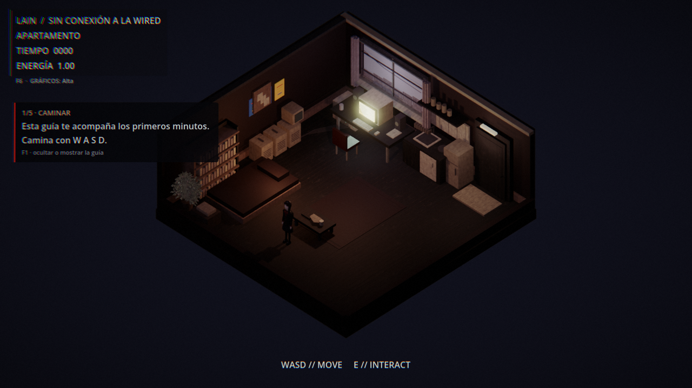
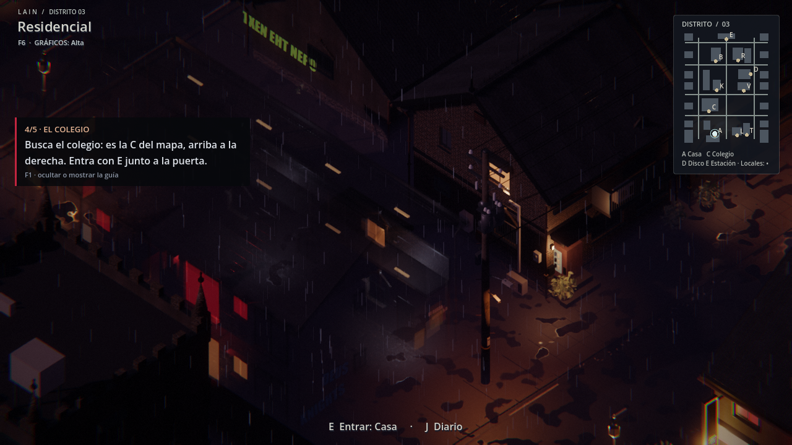
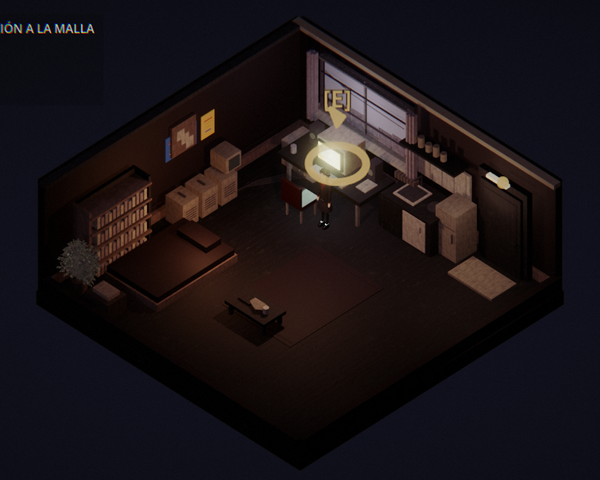

# LAIN · Guía de los primeros minutos

Hasta ahora, quien empezaba aparecía en su casa sin saber qué hacer. El
objetivo solo se veía si se abría el diario. Ahora un recuadro a la izquierda
acompaña los primeros minutos y avanza solo cuando el jugador hace cada cosa:

| Paso | Qué pide | Se completa cuando… |
|---|---|---|
| 1/5 · Caminar | W A S D | camina un par de metros |
| 2/5 · Tu diario | J | abre el diario |
| 3/5 · Salir | E junto a la puerta | sale al barrio |
| 4/5 · El colegio | la C del mapa | entra en el colegio |
| 5/5 · Hablar | E junto a alguien | empieza una conversación |

Después, mientras dura el prólogo, el recuadro muestra el **objetivo** actual,
el mismo que trae el diario. Cuando el jugador conecta con Indara, el
recuadro desaparece; las capas ya enseñan su objetivo arriba a la derecha.

La primera vez que se abre cada terminal aparece una línea de ayuda:
- en el Terminal: escribe `help` para ver las órdenes y `pista` si te atascas;
- en el ordenador de casa: lo que contó Ryoko está en el diario.

**F1** oculta o vuelve a mostrar el recuadro. Quien ya había pasado del primer
objetivo no ve los pasos, solo el objetivo y las ayudas de los terminales.

## Lo que se puede usar

Todo lo interactivo se distingue del decorado:
- **Cerca** (unos 7 metros), cada cosa que se puede usar tiene encima una luz suave.
- **A tu alcance**, la que usarías al pulsar E (A con mando) tiene un **anillo** que late
  en el suelo y una **flecha** con la tecla encima.

Es exactamente la que responde, porque la elige la misma regla que la interacción.
Mientras hay una ventana, un terminal o una cinemática abiertos, no se ve nada.

## Cómo está hecho

- `client/scripts/ui/Guide.gd` (autoload) solo lee el estado que ya muestra
  la interfaz y qué ventanas están abiertas; nunca cambia el mundo. El
  progreso se guarda en `user://guide.cfg`, en el PC del jugador.
- Textos en inglés en el catálogo de siempre (`TRADUCCION.md`).
- `client/tools/test_guide.gd` recorre los cinco pasos, el objetivo, F1, la
  ayuda del Terminal, un jugador veterano y que el estado no cambia.
- `client/tools/capture_guide.gd` hace las capturas de arriba.
- `client/scripts/world/InteractHighlight.gd`, hijo del jugador (`IsoController`),
  dibuja las marcas; `IsoController.nearest_interactable()` es la regla común.
  `client/tools/test_highlight.gd` lo prueba y `client/tools/capture_highlight.gd`
  hace la captura.
