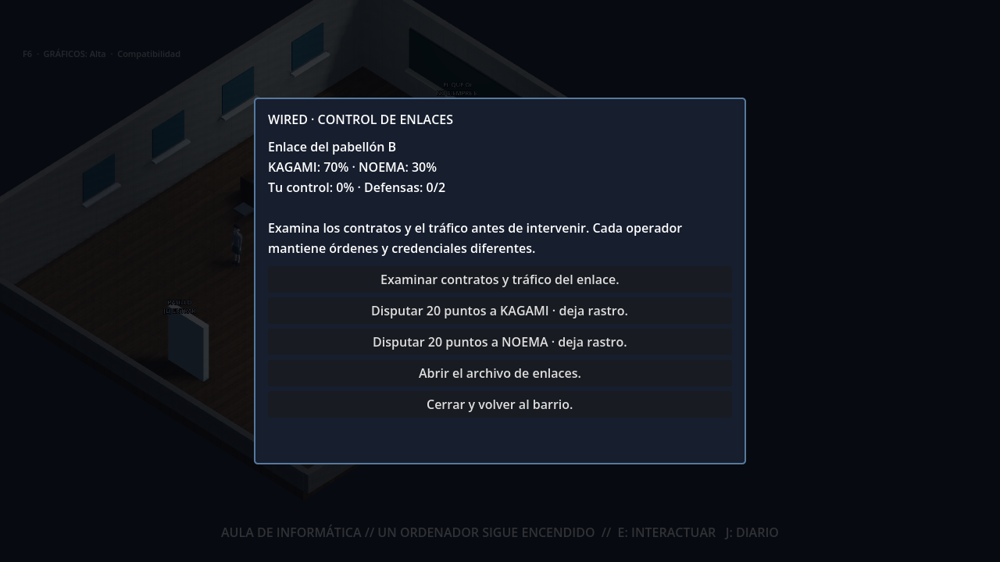
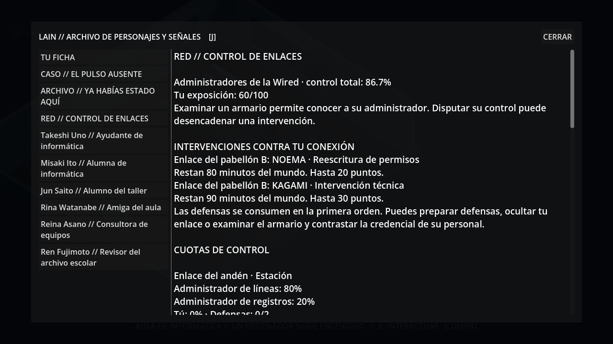
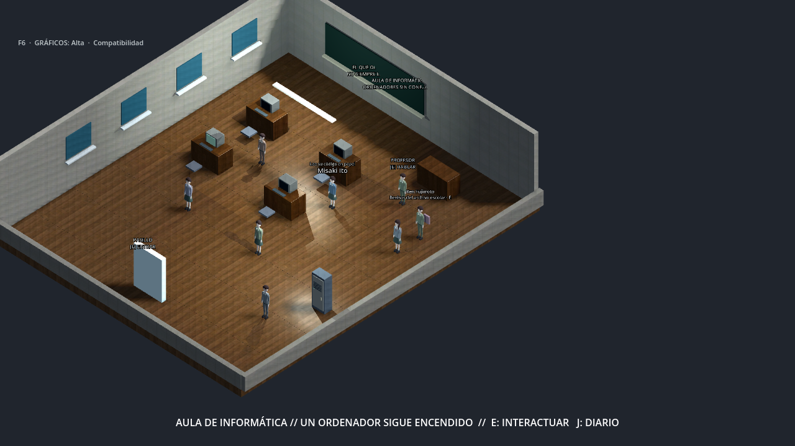

# WIRED 0.3 · Dos administradores

Rama experimental **experiment/wired-0.3-noema**, desde 41f6881
(taller WIRED 0.2). No fusiona ni sustituye otras ramas.

NOEMA disputa ahora el control de tres enlaces y tiene personal encubierto en
la ciudad. KAGAMI controla infraestructura; NOEMA intenta recuperar permisos
mediante reescrituras de registros. Ninguna creó la Wired.

## Recorrido para probarlo

1. Después de la primera conexión a la Wired, ve al **aula de informática**.
   Acércate al armario de enlace, pulsa **E** y examina contratos y tráfico.
   Ahora aparecen dos cuotas y puedes elegir a qué corporación disputar control.
2. Elige **Disputar 20 puntos a NOEMA**. Consulta **J → RED / CONTROL DE ENLACES**:
   verás una reescritura pendiente, con plazo y pérdida máxima.
3. Vuelve a examinar el armario mientras la orden siga pendiente. Acércate a
   **Ren Fujimoto**, el revisor del archivo escolar, junto al lateral del aula.
   Habla con él y contrasta su credencial con la orden interceptada.
4. Las órdenes de NOEMA de ese enlace se interrumpen. Su actividad queda
   suspendida durante 120 minutos del mundo. KAGAMI puede tomar hasta cinco
   puntos de la cuota que conserve NOEMA; tus puntos no cambian por este hecho.
5. Prueba a disputar control a las dos corporaciones, dejando pasar un avance
   del reloj entre acciones. El diario identifica cada orden. Detener una
   corporación deja las órdenes de la otra activas.
6. Busca también a **Mika Senda**, encuestadora de transporte en la **estación**,
   y a **Aya Morita**, catalogadora de cintas en **Video Hoshi**. Cada enlace
   exige su propia prueba y conserva su propia suspensión.

## Reglas de esta fase

| Regla | KAGAMI | NOEMA |
| --- | --- | --- |
| Respuesta al disputarle control | Intervención técnica | Reescritura de permisos |
| Plazo desde que se emite | 100 minutos del mundo | 80 minutos del mundo |
| Pérdida máxima sin defensa | 30 puntos | 20 puntos |
| Suspensión al contrastar prueba vigente | 120 minutos, solo ese enlace | 120 minutos, solo ese enlace |

Los plazos usan el reloj de la partida, no minutos reales. El lanzador normal
avanza diez minutos del mundo cada ocho segundos; moverse también puede
avanzarlo. Leer el diario no detiene el servidor.

Cada defensa absorbe 15 puntos; las defensas preparadas se consumen en la primera
orden que se resuelve. Protección y la cobertura del contrato de KAGAMI también
funcionan contra NOEMA. El acuerdo con NOEMA sigue prestando Exploración y
registra únicamente enlace, minuto y cantidad de órdenes sobre tu cuenta en
cada escaneo explícito. Los contratos no conceden inmunidad.

Ocultar un enlace desde casa o desde su armario cancela las órdenes de ambas
corporaciones dirigidas a tu cuenta en ese enlace y cede hasta cinco puntos a
KAGAMI. No cancela órdenes contra otras cuentas.

La afiliación de cada persona se comprueba individualmente. Examinar contratos
identifica al administrador; para vincular al agente a una operación necesitas
inspeccionar una orden todavía pendiente y contrastarla presencialmente. Una
prueba vencida, de otra corporación o de otro enlace no sirve. Exploración desde
casa no concede esa prueba. Los informes del diario guardan su minuto y fuente.

No hay conquistas pasivas ilimitadas al dejar el juego abierto. Cada disputa
puede programar una orden por corporación, enlace y cuenta; cada orden se resuelve
una vez. Al exponer un agente, la rival solo puede transferir cuota que todavía
pertenezca a la corporación expuesta. Las cuotas corporativas y humanas de cada
enlace suman siempre 100.

## Partida y arranque

En este equipo se ha preparado **C:\Users\ENRIQUE\lain-noema01\noema01.db** a
partir del guardado de **lain-workshop01**. El origen se abrió solo para lectura
y se verificaron sus 54 tablas antes de incorporar NOEMA. La incorporación
conservó exactamente las otras 53 tablas: recuerdos, progresos, código, equipos,
contratos, pruebas individuales y operaciones anteriores. Tu ubicación continúa
en el aula de informática. El guardado no se sube a GitHub.

La incorporación a un guardado existente transfiere desde KAGAMI hasta 20 puntos
en la estación, 30 en el aula y 45 en el videoclub. Nunca descuenta puntos humanos.
Se realiza una sola vez y conserva el significado de órdenes y reintentos
anteriores. Una vez guardadas, las cuotas de NOEMA no desaparecen por apagar la
opción de inicialización.

Servidor, desde una ventana nueva:

~~~powershell
cd C:\Users\ENRIQUE\lain-noema01; powershell -ExecutionPolicy Bypass -File .\serve-city.ps1
~~~

Juego, en otra ventana:

~~~powershell
cd C:\Users\ENRIQUE\lain-noema01; powershell -ExecutionPolicy Bypass -File .\play.ps1
~~~

Si otra versión ocupa el puerto 8000, cierra su servidor antes de iniciar este.
El lanzador usa noema01.db y activa LAIN_NOEMA=1 junto al taller y al capítulo.
Respeta los ajustes de LLM que ya hayas definido.

Para importar otra partida, elige un nombre de destino que no exista:

~~~powershell
python tools/copy_workshop_save.py C:\ruta\partida.db .\otra-partida.db
powershell -ExecutionPolicy Bypass -File .\serve-city.ps1 -WorldPath .\otra-partida.db
~~~

## Validación y límites

~~~powershell
python -m pytest -q tests/test_noema.py tests/test_network_conflict.py tests/test_workshop.py
python tools/smoke_chapter01_http.py --noema
Godot_v4.7.2-stable_win64_console.exe --headless --path client --script res://tools/test_noema01.gd
~~~

Las pruebas comprueban conservación de cuotas, disputas simultáneas, lectura sin
mutaciones, reintentos, pruebas privadas por corporación y enlace, defensas,
contratos, escaneo, migración y rechazo de identidades elegidas desde el cliente.
La prueba HTTP levanta su propio mundo y puerto temporales. La prueba Godot
comprueba nueve vistas, acceso físico, selección con E, nombres independientes,
controles desplazables, diario y PC. Las capturas usan datos sintéticos.

World Core sigue resolviendo acciones y SQLite conserva el estado. El cliente
presenta resultados públicos; las memorias de K y Nora no se comparten.
El LLM conversacional, el prólogo, el capítulo, el taller y los gráficos anteriores
siguen disponibles.

Esta entrega es local. Las alianzas entre jugadores, aportaciones de dispositivos
y código entre cuentas, autenticación multijugador y torneos programados siguen
pendientes. Los nuevos agentes tienen presencia y diálogos de investigación
autorizados por World Core; todavía no patrullan ni improvisan conversaciones.
