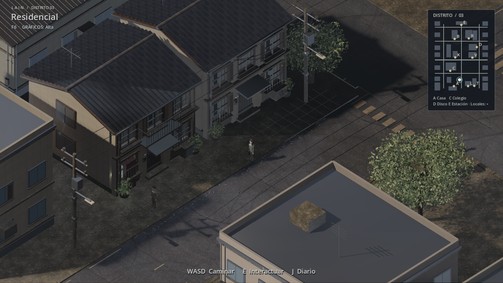
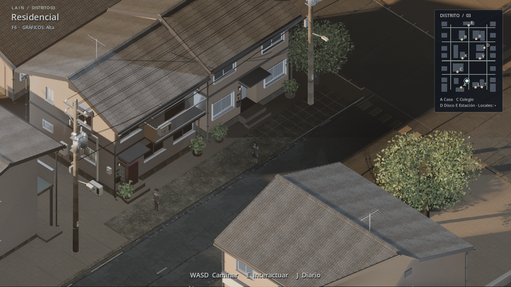

# LAIN · Visual 0.11 — barrio fotorrealista

Rama: `experiment/visual-0.11-photoreal`, sobre `chore/repo-hygiene`
(= `experiment/online-0.1-review-fixes` + limpieza del repo). Sin cambios en
el servidor, World Core, el formato de guardado ni las colisiones.

| Antes | Después |
| --- | --- |
|  |  |

Más capturas: [tiendas](docs/photoreal11/images/after-shops.png),
[plaza](docs/photoreal11/images/after-park.png) y
[vista de cerca](docs/photoreal11/images/after-closeup.png). Todas salen de
Godot 4.7.2 sin retoque, con `tools/capture_realism10.gd`.

## Qué cambia

- **Luz de tarde real.** El cielo es un HDRI fotografiado (Poly Haven) sin el
  disco solar; el sol del juego está alineado con el de la foto, más bajo
  (24°) y cálido. Sombras suaves de alta calidad, luz rebotada en pantalla
  (SSIL), niebla de profundidad, bloom sutil y antialiasing temporal en
  calidad Alta. SDFGI y la niebla volumétrica quedan apagados: con la cámara
  isométrica ortográfica dibujan costuras de luz pegadas a la cámara.
- **Los 42 edificios del barrio son modelos 3D reales**, no cajas: casas
  japonesas de dos plantas, *apāto* con pasillo exterior y escalera de acero,
  bloques de hormigón con azotea y depósito de agua, tiendas con escaparate,
  toldo y rótulo, casas de una planta, el colegio y el club. Huecos de verdad
  en los muros, ventanas correderas de aluminio, rejas, cajones de persiana,
  canalones y bajantes, aire acondicionado, contadores, balcones con ropa
  tendida y antenas.
- **Postes eléctricos japoneses** de hormigón (10,8 m) con crucetas,
  aisladores, transformadores y farola, y **cableado en catenaria**: media y
  baja tensión, teléfono y acometidas a las casas.
- **Suelo** de asfalto y hormigón fotografiados a escala real.
- **Borde del mundo**: suelo exterior y un anillo de edificios no jugables,
  para que la cámara nunca vea el vacío.
- Las puertas funcionales siguen en su sitio (colisión y entrada), pero sin
  malla propia: la puerta visible es la del edificio.

Rendimiento medido en la RTX 4060 del portátil, 1440×900, calidad Alta:
205–240 fps según la vista. F6 sigue alternando Ligera, Equilibrada y Alta.

## Cómo está construido (todo reproducible)

Los modelos no se hacen a mano: son scripts de Blender versionados.

| Paso | Herramienta |
| --- | --- |
| Descargar las fuentes CC0 y verificar su MD5 | `python tools/fetch_photoreal11.py` |
| Casas de dos plantas | `client/tools/blender/jp_houses.py` |
| Poste eléctrico | `client/tools/blender/jp_pole.py` |
| Especificación de los 40 edificios (tipo, orientación, puerta) | `python tools/photoreal11_specs.py` |
| Edificios paramétricos | `client/tools/blender/jp_block.py` |
| Biblioteca de materiales PBR (`.tres`) | `client/tools/build_photoreal11_materials.gd` |
| Enlazar materiales en los `.import` de cada GLB | `python tools/link_photoreal11_materials.py` |
| Montar el barrio | `client/tools/build_photoreal11.gd` |

Orden completo (Blender 5.2 portable y Godot 4.7.2):

```powershell
python tools/fetch_photoreal11.py
python tools/photoreal11_specs.py
blender -b --factory-startup --python client/tools/blender/jp_houses.py -- client/art/photoreal11/houses
blender -b --factory-startup --python client/tools/blender/jp_pole.py -- client/art/photoreal11/props
blender -b --factory-startup --python client/tools/blender/jp_block.py -- client/tools/blender/photoreal11_buildings.json client/art/photoreal11/buildings
godot --headless --path client --editor --import --quit
godot --headless --path client --script res://tools/build_photoreal11_materials.gd
python tools/link_photoreal11_materials.py
godot --headless --path client --editor --import --quit
godot --path client --script res://tools/build_photoreal11.gd
```

El último paso necesita un renderizador real (sin `--headless`) para que las
MultiMesh existentes conserven sus transformaciones al volver a guardarse.
Los GLB y la escena resultante ya están en el repositorio: para jugar no hay
que ejecutar nada de esto.

Detalles técnicos que conviene conocer:

- Cada edificio tiene dos instancias de su GLB: la visible, bajo el nodo
  `Upper` que el corte isométrico oculta, sin sombra; y una gemela que solo
  proyecta sombra. Así el sol respeta la forma real del tejado aunque el
  edificio esté oculto. La antigua caja de sombra envolvía el edificio entero
  y oscurecía los tejados.
- Los postes y cables antiguos estaban fundidos en MultiMesh compartidas; se
  colapsan solo sus instancias (587 piezas) y se conservan sus colisiones.
- Los rótulos de las tiendas, el club, la estación y el colegio se recolocan
  sobre las fachadas nuevas; los números de casa se retiran.

## Validación

- Las 16 pruebas de Godot del workflow `reality04-godot.yml` pasan en local,
  incluidas `test_city08`, `test_city09` (56 residentes, 6 tiendas),
  `test_realism10` y `test_chapter01`.
- `tools/smoke_online01.py`: dos clientes reales, identidades separadas,
  avatares, chat y viajes independientes (`ONLINE01_TCP_OK`).
- Sin cambios de Python en el servidor.

## Limitaciones conocidas

- **Personajes**: siguen siendo los avatares sencillos anteriores; ahora son
  lo que más desentona. Es el siguiente paso natural.
- Interiores (tiendas, colegio, estación, apartamento) sin cambios.
- Árboles: follaje geométrico de Visual 0.10. El árbol de Poly Haven tiene
  un millón de triángulos y no se ha usado.
- Los edificios de relleno exteriores reutilizan modelos del barrio.
- El repositorio crece unos 95 MB (texturas 2K y GLB).
