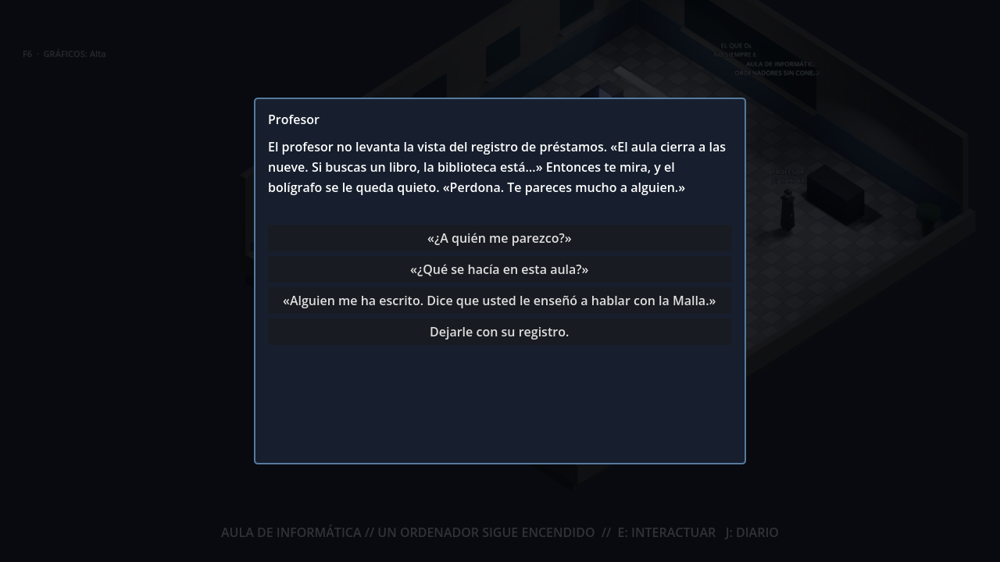

# Sesión Cero · Los primeros diez minutos

El prólogo («Capa 00 · Arranque») es lo primero que juega todo el mundo, y tiene
que enganchar. Esto es lo que vive un jugador nuevo, en orden.

1. **La terminal de arranque** antes del menú (`Intro.gd`).
2. **El despertar.** En casa, el ordenador, apagado desde hace años, se enciende
   solo. Alguien que firma «SESIÓN CERO» escribe con prisa:
   - que has vuelto;
   - que la están reescribiendo;
   - que busques a quien le enseñó a hablar con la Malla, en el aula de informática
     del colegio.

   Así el jugador tiene un motivo, y no solo una flecha en un mapa.
3. **El título.** La primera vez que sales, el barrio desde lo alto, de noche, y
   «SESIÓN CERO · PROTOCOLO DE PRESENCIA».
4. **El profesor** (aula de informática). No levanta la vista del registro hasta que
   te ve: «Te pareces mucho a alguien».
   - Si le preguntas, busca en el registro a esa persona: se dio de baja con su
     firma, y él no recuerda que se despidiera (NOEMA reescribe registros).
   - Si le dices que alguien te ha escrito, te habla de Ryoko y de dónde pasa las
     noches: el Pasaje Azul, abajo, donde suena la música.
5. **Ryoko** (el sótano del Azul). Desconfía: sin el profesor, no te habla de la
   Malla.
   - Si le cuentas lo de la Sesión Cero, se queda helada: ese nombre no debería
     existir.
   - Te enseña su hoja, MALLA y 23, pero no te dice qué escribir delante.
   - Después puedes pedirle siempre que te la vuelva a enseñar («¿Me vuelves a enseñar la hoja?»).
6. **El ordenador de casa** (CERO-DOS). `help` dice qué órdenes tiene el sistema, entre
   ellas `TELNET <red> <puerto>`; la red y el puerto los sabes por Ryoko.
   `type boot.log` enseña la noche en que se cerró la Sesión Cero y quién cambió el
   motivo.
7. **La conexión.** El saludo entre las dos máquinas en pantalla (SYN, SYN-ACK, ACK) y
   la Malla: «Tú eres la Sesión Uno».

## Las conversaciones

Ya no son un menú fijo de preguntas.
- Cada respuesta trae lo que el jugador puede decir después, según lo que ya se ha
  dicho y en qué punto está.
- Las frases del jugador son suyas, entre comillas.
- Los personajes tienen voz:
  - el profesor cree en los registros y no firma lo que no puede explicar;
  - Ryoko desconfía y sabe que los registros se reescriben.
- Nadie trata al jugador de él o de ella.

Se mantienen las reglas de siempre:
- ningún personaje dice la orden ni el protocolo;
- el profesor no dice «discoteca»;
- el dato de acceso es siempre «MALLA y 23».

## Cómo está hecho

- `server/world_core/prologue.py`: las frases (`PROFESSOR_LINES`, `RYOKO_LINES`), lo
  que puede decir el jugador (`PROFESSOR_CHOICES`, `RYOKO_CHOICES`) y qué sigue a cada
  respuesta (`_professor`, `_ryoko`); la respuesta lleva `choices`. Los objetivos del
  diario siguen la historia.
- `client/scripts/world/PrologueNpc.gd` enseña esas opciones (y las del taller cuando
  toca).
- `client/scripts/ui/Cinematic.gd`: el despertar (`_opening`), el título (`_title`, el
  plano `title`) y el saludo antes de la conexión (`_wired`). El texto del ordenador se
  escribe con `type_screen`.
- `client/scripts/ui/PrologueTerminal.gd`: `help` y `BOOT.LOG`.
- Pruebas: `tests/test_prologue_01_school_ryoko_terminal.py`, `tests/test_i18n_english.py`
  y `client/tools/test_cinematic.gd`. Capturas: `capture_cinematics.gd` y
  `capture_dialogue.gd`.
