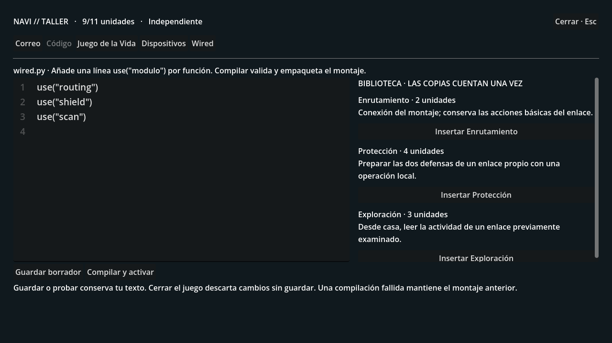
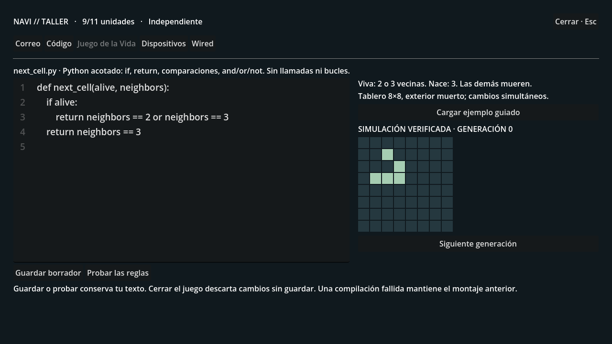
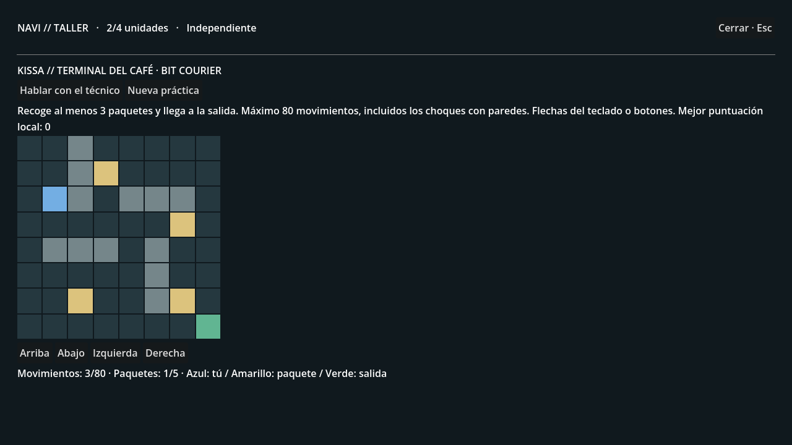

# WIRED 0.2 · El taller

Rama experimental **experiment/wired-0.2-workshop**, creada desde a86f423.
No se fusionan ramas ni se reemplazan guardados anteriores.

## Primera versión jugable

El PC de casa abre un taller después de la primera conexión a la Wired.
Incluye correo, editor con líneas numeradas, ejercicio del Juego de la Vida,
biblioteca, dispositivos y acceso a la investigación y a los enlaces anteriores.

1. Ve a **Kissa Café**, en el barrio. El nuevo terminal está a la derecha de la
   sala. Pulsa **E** y habla con el técnico. Entrega otra copia de Enrutamiento:
   figura con su propia procedencia, pero no duplica capacidad.
2. En el **aula de informática**, habla con el profesor y elige **Pedir las reglas
   del Juego de la Vida**. La investigación del capítulo 1 sigue disponible.
3. Regresa al **PC del apartamento → Juego de la Vida**. Completa la función
   next_cell(alive, neighbors) y pulsa **Probar las reglas**. Puedes cargar el
   ejemplo guiado o buscar ayuda fuera del juego; la recompensa es la misma.
4. Al superar los 18 casos recibes **Coprocesador M** y **Protección**. En
   **Dispositivos**, conecta el coprocesador. En **Código**, inserta Protección
   junto a Enrutamiento y pulsa **Compilar y activar**.
5. Examina y disputa uno de los armarios de enlace. Cuando el reloj permita
   otra operación, usa **Ejecutar Protección**: prepara las dos defensas de una
   vez. Se consumen en la próxima intervención, como las defensas anteriores.
6. Vuelve al terminal del café y prueba **Bit Courier**. Recoge al menos tres
   paquetes y llega a la salida antes de agotar 80 movimientos. Usa flechas o
   botones; chocar con una pared también gasta un movimiento.
7. La primera victoria entrega **Interfaz R** y **Exploración**. Conecta el equipo,
   añade Exploración y compila. Desde casa puedes consultar la actividad de
   enlaces que hayas examinado previamente. No proporciona pruebas privadas
   de otra persona ni sustituye la inspección presencial de una credencial.

## Montajes y copias

Navi A aporta 4 unidades, Coprocesador M aporta 4 e Interfaz R aporta 3.
Enrutamiento consume 2, Protección 4 y Exploración 3. Un modelo funcional y
un módulo se cuentan una sola vez, aunque existan copias con distinta procedencia.

El lenguaje del montaje acepta únicamente las llamadas use("routing"),
use("shield") y use("scan"), con comentarios y líneas repetidas. Estas llamadas
pertenecen al entorno ficticio de LAIN: se validan y empaquetan, no se ejecuta
Python general. El ejercicio usa un subconjunto explícito de sintaxis Python:
función, argumentos dados, if, return, comparaciones, and, or, not, booleanos y
números 0–8. No admite llamadas, importaciones, atributos, bucles, archivos ni
acceso a red. World Core interpreta un árbol acotado; nunca utiliza eval, exec
o la ejecución del código del jugador en el sistema.

El tablero 8×8 calcula vecinos con exterior muerto y actualiza todas las células
simultáneamente. La solución se verifica en los 18 casos posibles, no por una
comparación textual con un único ejemplo. La simulación muestra generaciones
calculadas por el servidor.

Guardar, probar o compilar conserva el borrador. Los errores de compilación
mantienen la última versión válida. Desconectar un equipo necesario o retirar un
permiso prestado vuelve al montaje básico y conserva el borrador para repararlo.
Los borradores sin guardar permanecen al cambiar de pestaña durante esa sesión,
pero se pierden al cerrar el juego.

## Ofertas

Después del ejercicio aparecen dos contratos locales y una opción independiente:

- **KAGAMI:** segundo Navi A prestado, sin acumular capacidad; cobertura de 15
  puntos contra cada intervención, a cambio de reservar 1 unidad de cálculo.
- **NOEMA:** permiso prestado para Exploración, a cambio de reservar 1 unidad.
  Cada escaneo durante el contrato registra únicamente enlace, minuto y número
  de intervenciones dirigidas a tu cuenta. La interfaz lo indica.
- **Independiente:** termina el acuerdo. Pierdes solo el préstamo, permiso y
  cobertura del contrato; conservas los equipos y fragmentos ganados.

Son las primeras ofertas funcionales. **NOEMA todavía no disputa territorio ni
tiene agentes físicos.** Esa expansión, las alianzas entre jugadores, el préstamo
entre cuentas y los torneos con horarios y clasificación online quedan para las
siguientes fases. Bit Courier es un desafío local ilimitado con premio único.
Sus resultados los recalcula el servidor a partir de los movimientos; todavía
no es un sistema preparado contra bots para torneos públicos.

## Continuar tu partida

El lanzador abre workshop01.db y activa LAIN_WORKSHOP=1, junto a las funciones
anteriores. Conserva los ajustes de LLM elegidos y las opciones del mundo.

Si copias la versión desde GitHub, importa un guardado mediante la utilidad; se
niega a sobrescribir un destino existente:

~~~powershell
python tools/copy_workshop_save.py C:\ruta\corporation01.db .\workshop01.db
~~~

Se usa la copia consistente de SQLite y se verifica que todas las tablas
mantienen exactamente sus filas. El origen se abre en modo lectura. Para una
partida nueva, usa un nombre de guardado nuevo con serve-city.ps1 -WorldPath.
El prólogo sigue siendo obligatorio en una partida nueva.

Desde la carpeta de esta rama, servidor:

~~~powershell
powershell -ExecutionPolicy Bypass -File .\serve-city.ps1
~~~

En otra ventana, juego:

~~~powershell
powershell -ExecutionPolicy Bypass -File .\play.ps1
~~~

El juego sigue usando el servidor local del puerto 8000. Si tienes otra versión
abierta, cierra su servidor antes de iniciar este. El lanzador prepara los
recursos de Godot antes de abrir el juego.

## Comprobaciones

~~~powershell
$env:LAIN_LLM_ENABLED="0"; $env:LAIN_MEMORY_SEMANTIC="0"; python -m pytest -q
python tools/smoke_chapter01_http.py --workshop
Godot_v4.7.2-stable_win64_console.exe --headless --path client --script res://tools/test_workshop01.gd
~~~

Las pruebas usan mundos desechables: ubicación e identidad autoritativas,
soluciones alternativas y rechazo de instrucciones fuera del lenguaje, reglas
del tablero, recompensas únicas, reintentos, copias, capacidad, contratos,
protección real, procedencia individual y privacidad. La prueba HTTP recorre
escuela, casa y café mediante las acciones reales del servidor.

Godot comprueba las cinco pantallas, persistencia del borrador entre pestañas,
bloqueo de movimiento, respuesta tardía tras cerrar, acceso físico al terminal,
movimientos del minijuego y la opción del profesor. Las capturas proceden de
escenas y respuestas reales con datos sintéticos; no contienen el guardado del
usuario.
