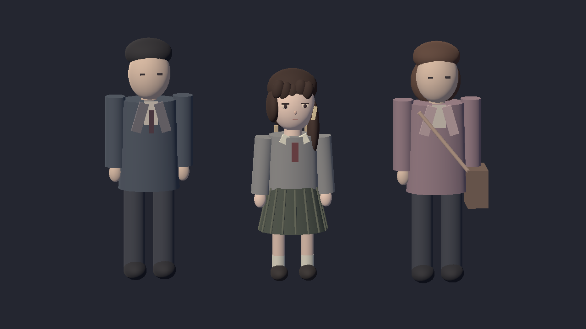
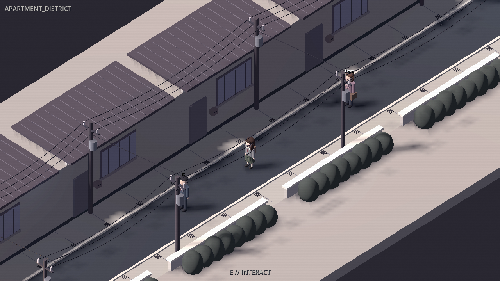
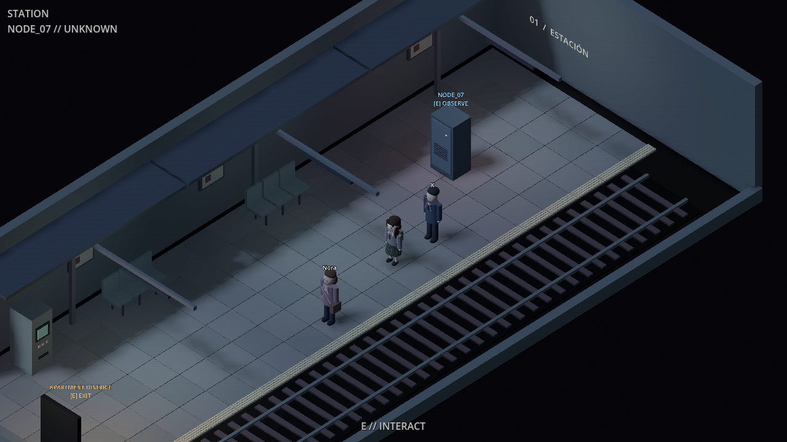

# Visual 0.4 — personajes, barrio y estación

Rama aislada: `experiment/visual-0.4-lain-environments`, basada en `d8e7dc6`
de Visual + Reality. Incluye la memoria D10/D11 y la creación opcional de
entidades de Reality. No fusiona ni reescribe las ramas anteriores.

## Assets incluidos

Todos los modelos están guardados como escenas editables de Godot. No es
necesario ejecutar el generador para jugar y no requieren descargas externas.

| Archivo bajo `client/art/` | Contenido |
| --- | --- |
| `characters/LainInspired.tscn` | Protagonista de pelo castaño asimétrico, pasador, uniforme gris, lazo, falda plisada, calcetines, mocasines y mochila. Conserva la animación de caminar. |
| `characters/AgentK.tscn` | K con abrigo oscuro y corbata. |
| `characters/Nora.tscn` | Nora con chaqueta malva y bolso. |
| `visual04/ResidentialStreet.tscn` | Fachadas, ventanas, puertas, buzones, tejados, aceras, desagües, muros, vegetación, postes, transformadores, aisladores y cables. |
| `visual04/StationDressing.tscn` | Baldosas, banda táctil, traviesas, bancos, marquesina, fluorescentes, carteles, máquina de billetes y armario NODE_07. |

El nuevo avatar aparece en apartamento, barrio y estación. Las luces del barrio
producen sombras largas y la estación usa luz fría. Las paredes próximas a la
cámara de la estación son bajas para dejar ver el andén. Nora se representa
sobre el andén en vez de sobre las vías. Su ubicación lógica sigue siendo STATION.

Es una adaptación 3D estilizada para la cámara isométrica. Los modelos son
geometría original, no dibujos ni modelos extraídos del anime. Las referencias
visuales consultadas incluyen el [personaje](https://note.com/ezakibisuko/n/n4f824600977f)
y las [calles y tendidos eléctricos](https://zerojustice315.wordpress.com/2017/06/20/serial-experiments-lain-and-the-future/).
Los carteles del andén contienen grafismos originales. El apartamento conserva
su textura y mobiliario de Visual 0.3.





## Probar en Windows

Cerrar el juego antes de cambiar de rama. Desde la carpeta del repositorio,
en este equipo `C:\Users\ENRIQUE\lain`:

```powershell
git fetch origin experiment/visual-0.4-lain-environments
git switch --track origin/experiment/visual-0.4-lain-environments
.\play.ps1
```

Si la rama ya existe localmente, usar `git switch experiment/visual-0.4-lain-environments`.
El servidor se inicia como hasta ahora. `play.ps1` importa primero los assets.
No borrar `world.db`; esta actualización no necesita reiniciar la partida.

Recorrer apartamento → barrio → estación, abrir el terminal, hablar con K/Nora
cuando estén presentes y acercarse a NODE_07. El servidor decide quién está
presente: las capturas de prueba usan actores ficticios para revisar sus modelos.

## Comprobaciones sin partida ni servidor

Los scripts de captura sustituyen WorldApi por un adaptador offline antes de
cargar escenas y desactivan la entrada del jugador. Las pruebas de navegación
mueven el cuerpo físico con pasos fijos: comprueban acceso al terminal,
las puertas y NODE_07. También comprueban que K/Nora desaparecen y regresan
según la lista de actores del snapshot y conservan sus identificadores.

```powershell
godot --headless --path client --editor --import --quit
godot --headless --path client --fixed-fps 60 --script res://tools/capture_apartment.gd
godot --headless --path client --fixed-fps 60 --script res://tools/capture_visual04.gd -- district
godot --headless --path client --fixed-fps 60 --script res://tools/capture_visual04.gd -- station
```

En este equipo el ejecutable se llama `Godot_v4.7.2-stable_win64_console.exe`.
La suite Python completa pasó: **194 tests**, con LLM y memoria semántica
desactivados. También se verificó la importación y las tres escenas desde una copia sin `.godot`.
No hay cambios de código del servidor, esquema SQLite, memoria ni autoridad de
World Core. El spawner solo cambia la representación de los actores visibles.

Herramienta de autoría opcional: `client/tools/build_visual04.gd` reconstruye los
cinco modelos. Sobrescribe sus escenas: no ejecutarla después de editarlas a mano
sin conservar esas ediciones. `capture_characters.gd` genera una vista de estudio;
`capture_visual04.gd -- district C:/ruta/imagen.png` guarda una captura del barrio.
