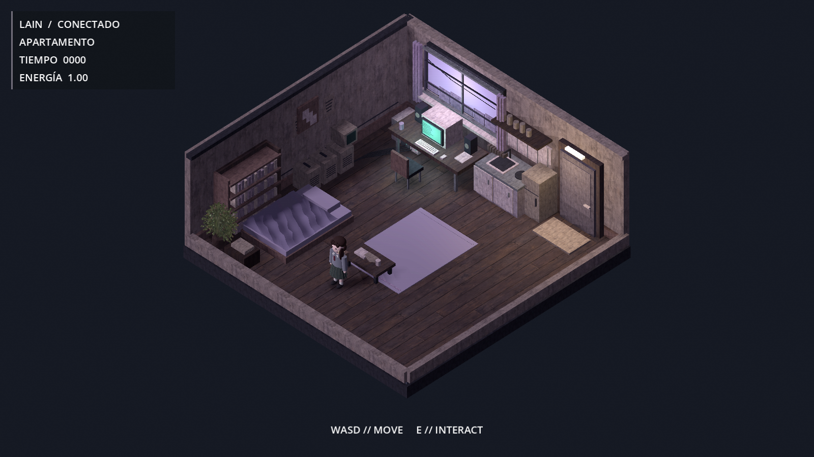
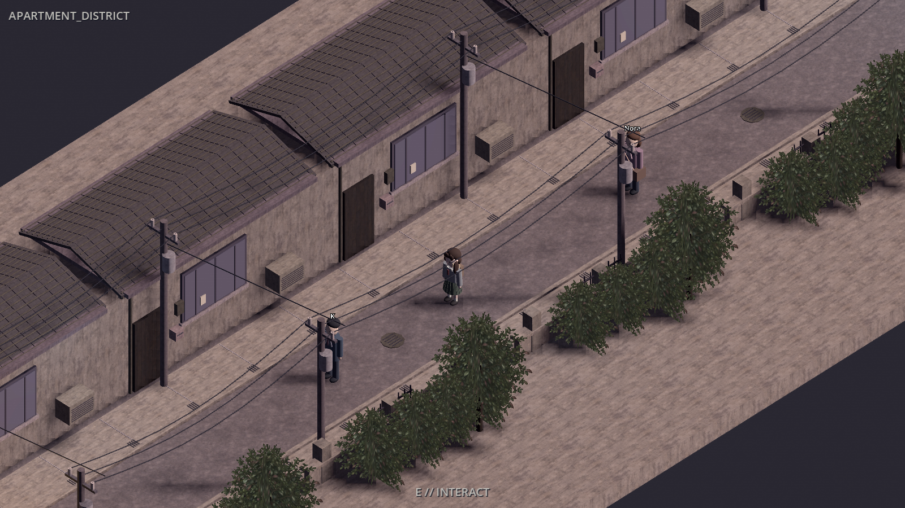
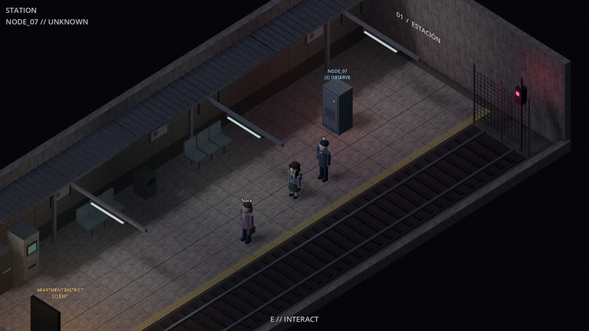

# Visual 0.5 — adaptación de la ilustración de referencia

Rama: `experiment/visual-0.5-illustrated`.
Base revisada: `cee4513`, de `experiment/reality-0.2-r1-llm-routing`.

Se revisaron los cambios nuevos de enrutamiento del diálogo, trazas de error,
diagnóstico sintético y reintento HTTP 400 con contexto reducido. Esta rama
conserva esos cambios, Reality 0.2, sus entidades y Visual 0.4. La adaptación
solo modifica presentación, escenas y assets; no modifica código Python,
memoria, reglas del mundo ni la partida del usuario.

## Dirección visual e implementación

La ilustración aportada por el usuario guía la paleta gris, taupe y violeta,
las superficies envejecidas, la vegetación, el contraste entre interior
doméstico y calle, y la iluminación fría del andén.

- Apartamento: suelo de madera texturizado, paredes envejecidas, manta con
  pliegues en malla, segundo CRT, altavoces, equipos, frigorífico, estante,
  botes, papeles, carteles, planta y divisiones adicionales en la ventana.
- Barrio: asfalto y hormigón, tejados inclinados con juntas, canalones y
  bajantes, aparatos de aire acondicionado, contadores, rejas, tapas de
  alcantarilla y vegetación con transparencia real. El sol produce sombras
  direccionales; el personaje y los accesos siguen visibles.
- Estación: baldosas y muros envejecidos, marquesina acanalada, fluorescentes
  visibles, banda táctil ocre, segunda máquina de billetes, papelera, valla,
  señal roja y balasto instanciado con MultiMesh.
- Texturas con mipmaps y filtrado anisotrópico para evitar ruido a distancia;
  MSAA 2× y sombras direccionales de 4096. Se conserva Compatibility.
- Menor intensidad de ruido y líneas CRT en el juego para dejar leer los
  materiales. No se altera el contenido de los diálogos ni su interfaz.

Es una adaptación 3D sobre las escenas jugables existentes. La ilustración
es más detallada y pictórica que los modelos actuales; no es una reproducción
idéntica del dibujo. Se mantiene la distribución del mapa y el aspecto del
avatar de Visual 0.4. Las capturas siguientes son renderizados reales de Godot,
con actores de prueba y sin conexión al servidor.





## Assets entregados

Todo está dentro de `client/art/visual05/`. Hay cuatro PNG originales generadas
para el proyecto: hormigón, asfalto, madera y vegetación RGBA, con sus ajustes
de importación. Los materiales `.tres` y las nueve escenas `.tscn` se guardan
en el repositorio y se cargan directamente. Los assets anteriores se conservan.

El [manifiesto de materiales y prompts](../client/art/visual05/README.md)
documenta su procedencia. `client/tools/build_visual05.gd` es una herramienta
de autoría offline, no un constructor ejecutado al arrancar el juego. Utiliza
una semilla fija para el detalle y guarda las escenas. Al reconstruir, sobrescribe
solamente los modelos y materiales de Visual 0.5; conservar primero cualquier
edición manual realizada sobre esos archivos.

## Verificación

- **214 tests Python pasados**, incluido el enrutamiento LLM corregido,
  reintento con contexto reducido, memoria privada y entidades generadas.
  La suite usa proveedores simulados; no se consulta Ollama ni la partida.
- Importación desde una copia sin `.godot`, sin recursos ausentes.
- Pruebas físicas offline: terminal y salida del apartamento, puertas del
  barrio, aproximación a NODE_07 y salida de la estación.
- En barrio y estación, comprobación del spawner real: K, Nora y una entidad
  generada aparecen/desaparecen según el snapshot y mantienen su identidad.
- Capturas de las tres escenas revisadas a 1600×900, con el renderizador
  Compatibility. No se ha hecho un benchmark de rendimiento en otros equipos.

```powershell
godot --headless --path client --editor --import --quit
godot --headless --path client --fixed-fps 60 --script res://tools/capture_apartment.gd
godot --headless --path client --fixed-fps 60 --script res://tools/capture_visual04.gd -- district
godot --headless --path client --fixed-fps 60 --script res://tools/capture_visual04.gd -- station
```

## Probar localmente

Cerrar el juego y detener Uvicorn antes de cambiar de rama. En PowerShell:

```powershell
cd C:\Users\ENRIQUE\lain
git fetch origin
git switch --track origin/experiment/visual-0.5-illustrated
.\play.ps1
```

Arrancar Uvicorn en su propia ventana con la misma configuración LLM/Reality
que ya funciona. El lanzador importa los recursos antes de iniciar Godot.
No hace falta borrar caché, reiniciar el mundo ni eliminar `world.db`.
Si la rama ya existe, usar `git switch experiment/visual-0.5-illustrated`.
Recorrer apartamento → barrio → estación; abrir terminal, hablar con un actor
y observar NODE_07. La presencia de entidades sigue dependiendo del mundo.
