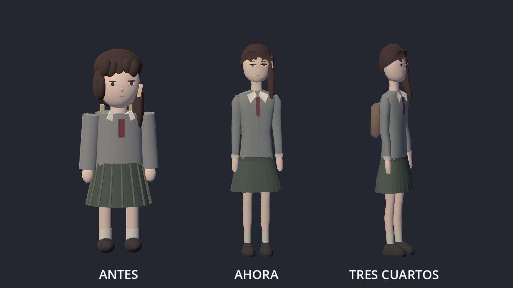
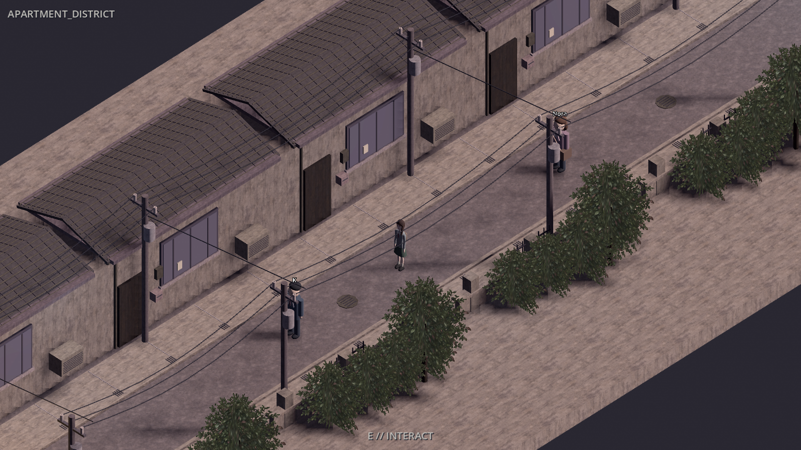

# Visual 0.6 — protagonista estilizada

Rama aislada `experiment/visual-0.6-slender-character`, basada en Visual 0.5
(`050eff3`). Conserva las correcciones LLM y Reality de esa base.

La protagonista usa ahora `client/art/characters/LainSlender.tscn` en las tres
escenas jugables. El modelo anterior se conserva para comparación. K, Nora,
las entidades digitales, los escenarios y la partida no cambian.

El cuerpo nuevo usa mallas con secciones modeladas: hombros inclinados, torso
entallado, mangas estrechadas hacia las muñecas, muslos y pantorrillas con
variación de forma. La cabeza es menor respecto al cuerpo, el rostro tiene
mandíbula definida, el pelo es una malla continua y la falda tiene pliegues
integrados. Se conserva el uniforme gris, el lazo, el mechón asimétrico, el
pasador y la mochila. El nuevo modelo no contiene CylinderMesh ni CapsuleMesh.

La animación añade balanceo de brazos y flexión de rodillas. Solo modifica la
pose visual; la cápsula física, velocidad, cámara y distancia de interacción
del jugador mantienen sus valores. Las articulaciones vuelven a reposo al parar.




## Verificación

Comprobados con Godot 4.7.2 Compatibility:

- Importación y renderizado del modelo, comparación frontal y vista lateral.
- Prueba determinista de escala, posición de pies, orientación, balanceo,
  rodillas y retorno a reposo: `CHARACTER06_CHECK_OK`.
- Navegación física offline del apartamento, barrio y estación; terminal,
  puertas y NODE_07 accesibles. Spawner de actores y entidades validado.

```powershell
godot --headless --path client --fixed-fps 60 --script res://tools/check_character06.gd
godot --headless --path client --fixed-fps 60 --script res://tools/capture_apartment.gd
godot --headless --path client --fixed-fps 60 --script res://tools/capture_visual04.gd -- district
godot --headless --path client --fixed-fps 60 --script res://tools/capture_visual04.gd -- station
```

No se modifica el servidor y estas comprobaciones no acceden a la partida.
`build_character06.gd` es una herramienta opcional de autoría offline:
reconstruye únicamente `LainSlender.tscn`; guardar las ediciones manuales antes
de ejecutarla. El juego carga la escena ya guardada y no necesita el generador.

## Probar

Con el juego cerrado, desde PowerShell:

```powershell
cd C:\Users\ENRIQUE\lain
git fetch origin
git switch --track origin/experiment/visual-0.6-slender-character
.\play.ps1
```

El servidor conserva la configuración que ya funciona. Si la rama ya existe,
usar `git switch experiment/visual-0.6-slender-character`.
